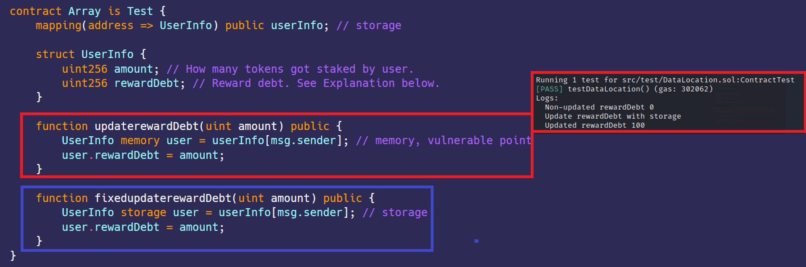

# 数据位置 - 存储与内存
[DataLocation.sol](https://github.com/SunWeb3Sec/DeFiVulnLabs/blob/main/src/test/DataLocation.sol)  
**名称：** 数据位置混淆漏洞  
**描述：**  
updaterewardDebt函数中滥用用户的存储和内存引用。  
updaterewardDebt 函数正在更新 UserInfo 结构体的rewardDebt 值存储在内存中。问题是这在函数调用之间不会持续存在。  
一旦函数执行完毕，内存就会被清除，所做的更改也会丢失。  


**缓解建议：**
确保函数参数中内存和存储的正确使用。明确所有位置。  

**参考：**  
https://mudit.blog/cover-protocol-hack-analysis-tokens-minted-exploit/  
https://www.educative.io/answers/storage-vs-memory-in-solidity  


数组合约：（紫色字为固定功能）
```
contract Array is Test {
    mapping(address => UserInfo) public userInfo; // 存储

    struct UserInfo {
        uint256 amount; // 用户抵押了多少代币
        uint256 rewardDebt; // 奖励债务，请参阅下面的说明
    }

    function updaterewardDebt(uint amount) public {
        UserInfo memory user = userInfo[msg.sender]; // 内存，漏洞点
        user.rewardDebt = amount;
    }

    function fixedupdaterewardDebt(uint amount) public {
        UserInfo storage user = userInfo[msg.sender]; // 存储
        user.rewardDebt = amount;
    }
}
```  
**如何测试：**  
```
// 演示Solidity中内存和存储数据位置之间差异的函数
function testDataLocation() public {
    // 模拟向Alice和Bob分配1个以太币
    address alice = vm.addr(1);
    address bob = vm.addr(2);
    vm.deal(address(alice), 1 ether);
    vm.deal(address(bob), 1 ether);

    // 创建Array合约的新实例
    ArrayContract = new Array();

    // 将Array合约中的rewardDebt存储变量更新为100
    ArrayContract.updaterewardDebt(100); 

    // 检索合约地址的userInfo结构并打印rewardDebt变量
    // 请注意，rewardDebt仍应为初始值，因为 updaterewardDebt操作的是内存变量，而不是存储变量
    (uint amount, uint rewardDebt) = ArrayContract.userInfo(address(this));
    console.log("Non-updated rewardDebt", rewardDebt);

    // 打印一条消息
    console.log("Update rewardDebt with storage");

    // 现在使用fixedupdaterewardDebt函数，它可以正确更新存储变量
    ArrayContract.fixedupdaterewardDebt(100);

    // 再次检索userInfo结构体，并打印rewardDebt变量
    // 这次rewardDebt应该更新为100
    (uint newamount, uint newrewardDebt) = ArrayContract.userInfo(
        address(this)
    );
    console.log("Updated rewardDebt", newrewardDebt);
}
```  
**红色框：** 错误更新的奖励债务  
**紫色框：** 问题已修复
