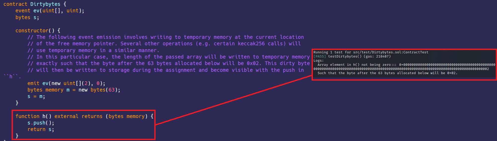

# 脏字节 
[Dirtybytes.sol](https://github.com/SunWeb3Sec/DeFiVulnLabs/blob/main/src/test/Dirtybytes.sol)   
**名称：** 在高于0.8.15版本Solidity中的脏字节  
将字节数组从memory或calldata复制到storage是以32字节为单位进行的，即使长度不是32的倍数。  
因此，超出数组末尾的额外字节可以从calldata或memory复制到storage。  
这些脏字节可能会在.push()之后变得可观察，而无需存储中字节数组的参数，即这样的push不会像预期的那样在数组末尾产生零值。  
此错误仅影响遗留代码生成流程，通过IR的新代码生成流程不受影响。  
```
"link": <https://blog.soliditylang.org/2022/06/15/dirty-bytes-array-to-storage-bug/>
"fixed": 0.8.15
``` 
**合约：**  
```
contract ContractTest is Test {
    Dirtybytes Dirtybytesontract;

    function testDirtybytes() public {
        Dirtybytesontract = new Dirtybytes();
        emit log_named_bytes(
            "Array element in h() not being zero::",
            Dirtybytesontract.h()
        );
        console.log(
            "Such that the byte after the 63 bytes allocated below will be 0x02."
        );
    }
}

contract Dirtybytes {
    event ev(uint[], uint);
    bytes s;

    constructor() {
        // 以下事件触发涉及写入空闲内存指针当前位置的临时内存。
        //  其他几个操作（例如某些keccak256调用）将以类似的方式使用临时内存。
        // 在这种特殊情况下，传递的数组的长度将被写入临时内存
        // 正是这样，下面分配的63个字节之后的字节将为0x02。  
        // 这个脏字节将在分配期间写入存储，并通过在“h”函数中push而变得可见。
        emit ev(new uint[](2), 0);
        bytes memory m = new bytes(63);
        s = m;
    }

    function h() external returns (bytes memory) {
        s.push();
        return s;
    }
}
```  
**如何测试:**   
forge test --contracts src/test/Dirtybytes.sol -vvvv  
**红色框：** h()中的数组元素不为零  

