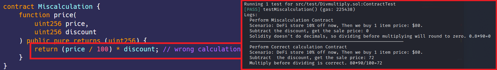

# 先除后乘  
[Divmultiply.sol](https://github.com/SunWeb3Sec/DeFiVulnLabs/blob/main/src/test/Divmultiply.sol)  
**名称：** 精度问题——先除后乘  
**描述：**  
这些合约展示了在Solidity中执行除法运算时的一个常见问题，  
因为Solidity不支持浮点数。由于整数截断，运算顺序可能会影响结果。   

在Miscalculation合约中，函数price中的(price / 100) * discount代码，先进行除法再进行乘法。由于Solidity会截断整数，进行除法时，如果price小于100，则price/100的结果将为0。这导致乘法的结果也为0。  

另一方面，在Calculation合约中，price函数中的(price / 100) * discount代码，先执行乘法再进行除法。这样，结果将与乘法一样正确
不会被截断，只有最终结果会被截断。  

**缓解建议：**  
始终在除法之前执行乘法以避免丢失精度。  

**参考：**  
https://twitter.com/1nf0s3cpt/status/1599774264437395461  
https://blog.solidityscan.com/precision-loss-in-arithmetic-operations-8729aea20be9  


**Miscalculation合约：**  
```
contract Miscalculation {
    function price(
        uint256 price,
        uint256 discount
    ) public pure returns (uint256) {
        return (price / 100) * discount; // 错误计算顺序
    }
}
``` 
**如何测试：**  
forge test --contracts src/test/Divmultiply.sol-vvvv  
```
// 这个函数是公共的，这意味着它可以被任何人或任何其他合约调用。
function testMiscalculation() public {

    // 初始化MiscalculationContract合约的新实例。
    MiscalculationContract = new Miscalculation();
    // 将字符串消息记录到控制台，表明MiscalculationContract 的测试正在开始。
    console.log("Perform Miscalculation Contract");
    // 记录场景详细信息。
    console.log("Scenario: DeFi store 10% off now, Then we buy 1 item price: $80.");
    // 使用两个参数80和90，调用MiscalculationContract上的price方法，并记录返回值。
    console.log("Subtract the discount, get the sale price:", MiscalculationContract.price(80, 90));
    // 记录错误计算的解释。
    console.log("Solidity doesn't do decimals, so dividing before multiplying will round to zero. 0.8*90=0");
    // 打印这一行来分隔两个不同的场景。
    console.log("---------------------------------------------------------");
    // 初始化CalculationContract合约的新实例
    CalculationContract = new Calculation();
    // 将字符串消息记录到控制台以表明CalculationContract上的测试正在开始
    console.log("Perform Correct calculation Contract");
    // 记录场景详细信息。
    console.log("Scenario: DeFi store 10% off now, Then we buy 1 item price: $80.");
    // 使用两个参数80和90，调用CalculationContract上的price方法，并记录返回值。
    console.log("Subtract the discount, get the sale price:", CalculationContract.price(80, 90));
    // 记录正确计算的解释。
    console.log("Multiply before dividing is correct. 80*90/100=72");
}
``` 
**红框：** 错误计算的价格。  

