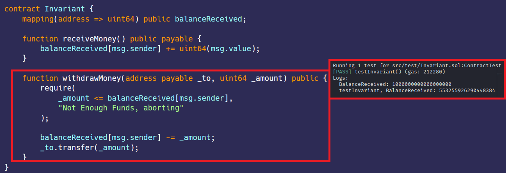

# Invariants 
[Invariant.sol](https://github.com/SunWeb3Sec/DeFiVulnLabs/blob/main/src/test/Invariant.sol)   
**Name:** Invariant issue

**Description:**  
Assert is used to check invariants. Those are states our contract or variables should never reach, ever. For example,
if we decrease a value then it should never get bigger, only smaller.

In the given code, the Invariant contract contains a receiveMoney function that accepts Ether and
increments the sender's balance with the amount received. This balance is stored as an uint64.
Unsigned integers can store values from 0 to 2^n - 1, so in this case 2^64 - 1, or roughly 18.4467 Ether.

If the sender sends more Ether than the maximum that can be stored in an uint64,
an overflow occurs, and the value rolls over to 0 and starts incrementing from there.
As a result, the balance does not accurately reflect the amount of Ether received by the contract.

**Mitigation:**  
To avoid this problem, it's important to ensure that the types you use for storing values
are appropriately sized for the values they need to store.

**REF:**

https://ethereum-blockchain-developer.com/027-exceptions/04-invariants-with-assert/  

**Invariant Contract:**  
```
contract Invariant {
    mapping(address => uint64) public balanceReceived;

    function receiveMoney() public payable {
        balanceReceived[msg.sender] += uint64(msg.value);
    }

    function withdrawMoney(address payable _to, uint64 _amount) public {
        require(
            _amount <= balanceReceived[msg.sender],
            "Not Enough Funds, aborting"
        );

        balanceReceived[msg.sender] -= _amount;
        _to.transfer(_amount);
    }
```
****How to Test:****

forge test --contracts src/test/**Invariant.sol** -vvvv  
```
// Function to demonstrate the Invariant issue.
function testInvariant() public {
    // Create a new instance of the Invariant contract.
    InvariantContract = new Invariant();

    // Send 1 Ether to the contract and print the balance.
    InvariantContract.receiveMoney{value: 1 ether}();
    console.log(
        "BalanceReceived:",
        InvariantContract.balanceReceived(address(this))
    );

    // Send 18 Ether to the contract and print the balance.
    // The contract should now have 19 Ether, but because of integer overflow, it'll display an incorrect balance.
    InvariantContract.receiveMoney{value: 18 ether}();
    console.log(
        "testInvariant, BalanceReceived:",
        InvariantContract.balanceReceived(address(this))
    );
}
```
Red box: bypassed invariant over overflow.

