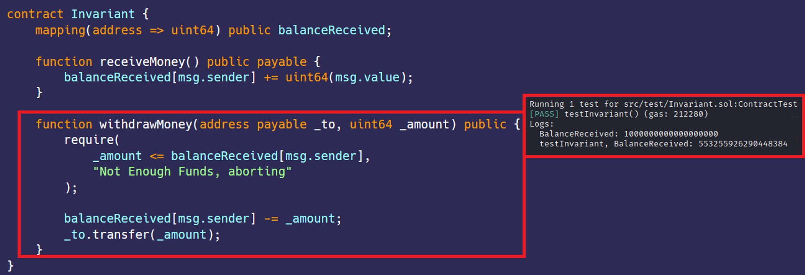

# 不变量  
[Invariant.sol](https://github.com/SunWeb3Sec/DeFiVulnLabs/blob/main/src/test/Invariant.sol)  
**描述：**  
Assert用于检查不变量。这些是我们的合约或变量永远不应该达到的状态。例如，如果我们减小一个值，那么它永远不会变大，只会变小。  

在给定的代码中，Invariant合约包含一个receiveMoney函数，该函数接受以太币和随着收到的金额增加消息调用者的余额。该余额存储为uint64。
无符号整数可以存储0到2^n - 1之间的值，因此在本例中为2^64 - 1，或大约18.4467以太币。  

如果消息调用者发送的以太币数量超过了uint64中可以存储的最大值，则会发生溢出，该值将翻转到0并从0开始递增。因此，余额并不能准确反映合约收到的以太币数量。  

**缓解建议：**  
为了避免这个问题，重要的是要确保用于存储值的类型大小适合它们需要存储的值。  
**参考：**  
https://ethereum-blockchain-developer.com/027-exceptions/04-invariants-with-assert/  

**Invariant合约：**  
```
contract Invariant {
    mapping(address => uint64) public balanceReceived;

    function receiveMoney() public payable {
        balanceReceived[msg.sender] += uint64(msg.value);
    }

    function withdrawMoney(address payable _to, uint64 _amount) public {
        require(
            _amount <= balanceReceived[msg.sender],
            "Not Enough Funds, aborting"
        );

        balanceReceived[msg.sender] -= _amount;
        _to.transfer(_amount);
    }
}
``` 
**如何测试：**
forge test --contracts src/test/Invariant.sol -vvvv  
```
// 演示不变性问题的函数
function testInvariant() public {
    // 创建Invariant合约的新实例
    InvariantContract = new Invariant();

    // 发送1个以太币到合约并打印余额
    InvariantContract.receiveMoney{value: 1 ether}();
    console.log(
        "BalanceReceived:",
        InvariantContract.balanceReceived(address(this))
    );

    // 发送18个以太币到合约并打印余额
    // 合约现在应该有19个以太币，但由于整数溢出，它会显示不正确的余额。
    InvariantContract.receiveMoney{value: 18 ether}();
    console.log(
        "testInvariant, BalanceReceived:",
        InvariantContract.balanceReceived(address(this))
    );
}
```
**红色框：** 绕过溢出不变式。

