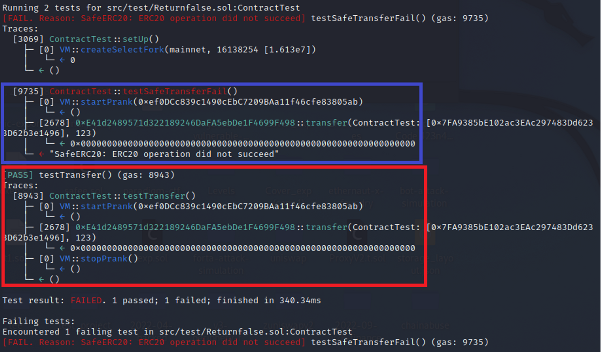

# No Revert on Failure  
[Returnfalse.sol](https://github.com/SunWeb3Sec/DeFiVulnLabs/blob/main/src/test/Returnfalse.sol)  
**Name:** No Revert on Failure

**Description:**  
Some tokens do not revert on failure, but instead return false (e.g. ZRX).  
```
ZRX transfer return false:
function transfer(address _to, uint _value) returns (bool) {
//Default assumes totalSupply can't be over max (2^256 - 1).
if (balances[msg.sender] >= _value && balances[_to] + _value >= balances[_to]) {
balances[msg.sender] -= _value;
balances[_to] += _value;
Transfer(msg.sender, _to, _value);
return true;
} else { return false; }
}
```
**Mitigation:**
Use OpenZeppelin’s SafeERC20 library and change transfer to safeTransfer.

**Contract:**  
```
contract ContractTest is Test {
    using SafeERC20 for IERC20;
    IERC20 constant zrx = IERC20(0xE41d2489571d322189246DaFA5ebDe1F4699F498);

    function setUp() public {
        vm.createSelectFork("mainnet", 16138254);
    }

    function testTransfer() public {
        vm.startPrank(0xef0DCc839c1490cEbC7209BAa11f46cfe83805ab);
        zrx.transfer(address(this), 123); //return false, do not revert
        vm.stopPrank();
    }

    function testSafeTransferFail() public {
        vm.startPrank(0xef0DCc839c1490cEbC7209BAa11f46cfe83805ab);

        // https://github.com/foundry-rs/foundry/issues/5367 can't vm.expectRevert
        // vm.expectRevert("SafeERC20: ERC20 operation did not succeed");
        zrx.safeTransfer(address(this), 123); //revert

        vm.stopPrank();
    }

    receive() external payable {}
}
```
**How to Test:**

forge test --contracts src/test/**Returnfalse.sol** -vvvv  
```
// Define a public function testTransfer
function testTransfer() public {
    // Start a prank which likely simulates a malicious activity or behavior, 
    // or creates some sort of atypical conditions for the test from the address specified
    vm.startPrank(0xef0DCc839c1490cEbC7209BAa11f46cfe83805ab);
    // Attempt to transfer 123 units of the ZRX token from the contract to this contract. 
    // If the transfer fails, the `transfer` method returns `false` instead of reverting
    zrx.transfer(address(this), 123); //return false, do not revert
    // Stop the prank which likely reverts the conditions to normal
    vm.stopPrank();
}

// Define a public function testSafeTransferFail
function testSafeTransferFail() public {
    // Start a prank as in the previous function
    vm.startPrank(0xef0DCc839c1490cEbC7209BAa11f46cfe83805ab);
    // This line of code is commented out. It seems to be setting an expectation that the function should revert 
    // with the message "SafeERC20: ERC20 operation did not succeed". This expectation is likely used in testing.
    // However, the issue mentioned in the URL indicates that this function does not work in this testing environment
    // vm.expectRevert("SafeERC20: ERC20 operation did not succeed");
    // Attempt to make a "safe" transfer of 123 units of ZRX from the contract to this contract.
    // Unlike the regular `transfer` method, `safeTransfer` will revert if the transfer fails.
    zrx.safeTransfer(address(this), 123); //revert
    // Stop the prank as before
    vm.stopPrank();
}
```
**Red box: do not revert on failure.**

**Purple box: do revert on failure, use safeTranser.**

