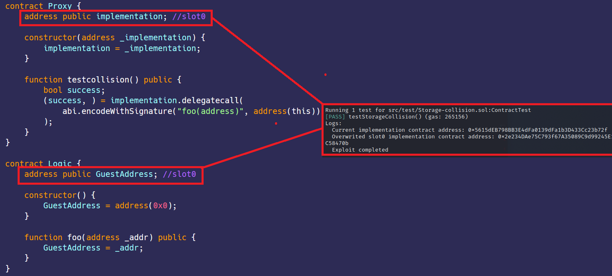

# 存储冲突  
[Storage-collision.sol](https://github.com/SunWeb3Sec/DeFiVulnLabs/blob/main/src/test/Storage-collision.sol)  
**名称：** 存储冲突漏洞

**描述：**  
漏洞在于Proxy和Logic合约都使用相同的存储槽（槽0）来存储重要变量，  
即Proxy合约中的implementation变量地址和Logic合约中的GuestAddress变量地址。  
由于Proxy合约使用delegatecall方法与Logic合约进行交互，  
他们共享相同的存储空间。如果调用foo函数，
它会覆盖Proxy合约中的implementation变量地址，从而导致意外行为。  

**缓解建议：**   
缓解此问题的一种方法是将proxy和logic合约的存储布局设计为彼此一致。  

**参考：**  
https://blog.openzeppelin.com/proxy-patterns  

**Proxy合约：**  
```
contract Proxy {
    address public implementation; //slot0

    constructor(address _implementation) {
        implementation = _implementation;
    }

    function testcollision() public {
        bool success;
        (success, ) = implementation.delegatecall(
            abi.encodeWithSignature("foo(address)", address(this))
        );
    }
}

contract Logic {
    address public GuestAddress; //slot0

    constructor() {
        GuestAddress = address(0x0);
    }

    function foo(address _addr) public {
        GuestAddress = _addr;
    }
}
```
**如何测试：**  
forge test --contracts src/test/Storage-collision.sol-vvvv  
```
// 测试存储冲突漏洞的函数。
function testStorageCollision() public {
    // 创建LogicContract合约的新实例。
    LogicContract = new Logic();

    // 创建ProxyContract的新实例，并将LogicContract的地址传递给Proxy构造函数。
    ProxyContract = new Proxy(address(LogicContract));

    // 记录实现合约（LogicContract）的当前地址。
    console.log(
        "Current implementation contract address:",
        ProxyContract.implementation()
    );

   
    //调用ProxyContract的testcollision()函数。该函数可能会更改也用于存储LogicContract地址的存储槽。
    ProxyContract.testcollision();

    // 记录实现合约被覆盖的地址。
    console.log(
        "Overwritten slot0 implementation contract address:",
        ProxyContract.implementation()
    );

    // 记录“漏洞攻击完成”。
    console.log("Exploit completed");
}
```
**红框：** 覆盖插槽0。  
