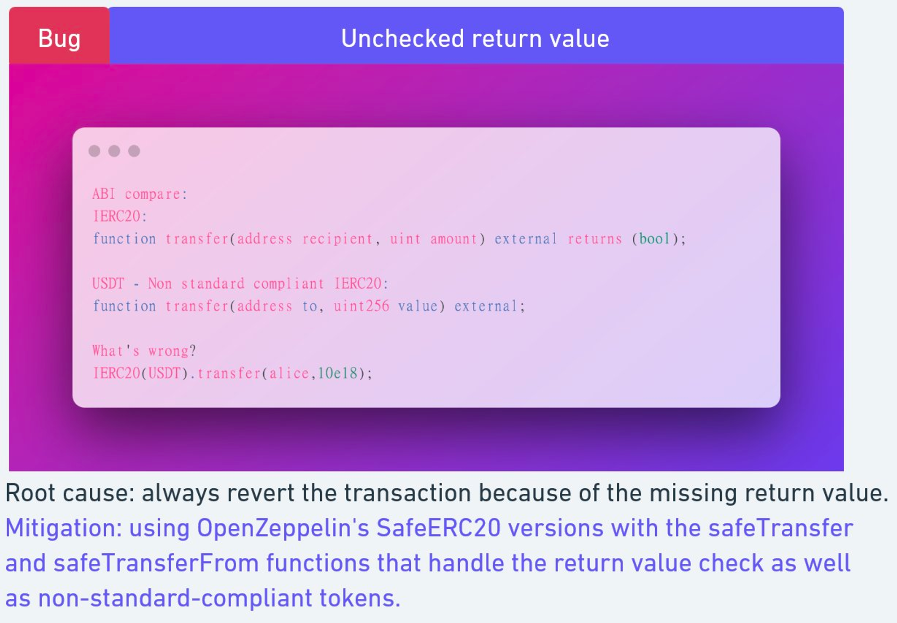
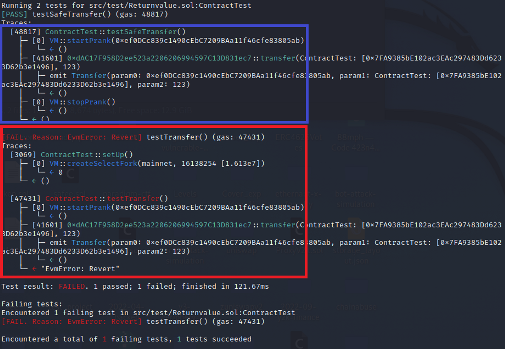

# Unchecked return value
[Returnvalue.sol](https://github.com/SunWeb3Sec/DeFiVulnLabs/blob/main/src/test/Returnvalue.sol)  
**Name:** Unchecked return value

**Description:**  
**EIP20 standard:**  
Returns a boolean value indicating whether the operation succeeded.
function transfer(address to, uint256 amount) external returns (bool);

USDT doesn't correctly implement the EIP20 standard, so calling these functions with the correct EIP20 function signatures will always revert.
function transfer(address to, uint256 value) external;

ERC20 transfer:  
```
function transfer(address to, uint256 amount) public virtual returns (bool) {
address owner = _msgSender();
_transfer(owner, to, amount);
return true;
```
USDT transfer without a return value:  
```
function transfer(address _to, uint _value) public onlyPayloadSize(2 * 32) {
...
}
Transfer(msg.sender, _to, sendAmount);
}
```
**Mitigation:**  
Use OpenZeppelin’s SafeERC20 library and change transfer to safeTransfer.

**REF:**

https://twitter.com/1nf0s3cpt/status/1600868995007410176

**Contract:**  
```
interface USDT {
    function transfer(address to, uint256 value) external;

    function balanceOf(address account) external view returns (uint256);

    function approve(address spender, uint256 value) external;
}

contract ContractTest is Test {
    using SafeERC20 for IERC20;
    IERC20 constant usdt = IERC20(0xdAC17F958D2ee523a2206206994597C13D831ec7);

    function setUp() public {
        vm.createSelectFork("mainnet", 16138254);
    }

    function testTransfer() public {
        vm.startPrank(0xef0DCc839c1490cEbC7209BAa11f46cfe83805ab);
        usdt.transfer(address(this), 123); //revert
        vm.stopPrank();
    }

    function testSafeTransfer() public {
        vm.startPrank(0xef0DCc839c1490cEbC7209BAa11f46cfe83805ab);
        usdt.safeTransfer(address(this), 123);
        vm.stopPrank();
    }

    receive() external payable {}
}
```
**How to Test:**

forge test --contracts src/test/Returnvalue.sol -vvvv  
```
// Define a public function testTransfer
function testTransfer() public {
    // Use a contract (vm) method to simulate a prank from the address specified
    vm.startPrank(0xef0DCc839c1490cEbC7209BAa11f46cfe83805ab);
    // Try to transfer USDT tokens from the contract address to the current contract.
    // The value "123" is the number of tokens to transfer. 
    // If the contract doesn't have enough tokens, or if the address specified in startPrank doesn't authorize this transfer, it will throw an error and all state changes in the current contract will be reverted.
    usdt.transfer(address(this), 123); //revert
    // Stop the prank. This presumably restores the original state, but is not executed if the transfer above fails.
    vm.stopPrank();
}

// Define a public function testSafeTransfer
function testSafeTransfer() public {
    // Use a contract (vm) method to simulate a prank from the address specified
    vm.startPrank(0xef0DCc839c1490cEbC7209BAa11f46cfe83805ab);
    // Attempt to perform a safe transfer of USDT tokens from the contract address to this contract.
    // safeTransfer is similar to transfer, but it will also check if the recipient is a contract. 
    // If it is, safeTransfer will call a function on the recipient contract to ensure it is prepared to receive tokens. 
    // This can prevent tokens from becoming locked in a contract that is not prepared to handle them.
    usdt.safeTransfer(address(this), 123);
    // Stop the prank. As with testTransfer, this is not executed if the safeTransfer call fails.
    vm.stopPrank();
}
```
  
**Red box: reverted.**  

**Purple box: use safeTransfer, no revert.**

