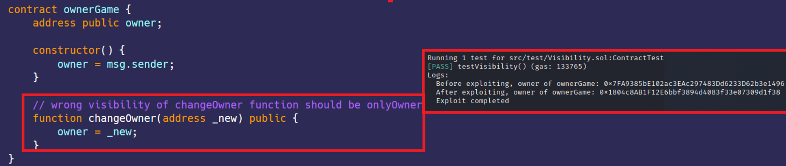

# 可见性  
[Visibility.sol](https://github.com/SunWeb3Sec/DeFiVulnLabs/blob/main/src/test/Visibility.sol)  
**名称：** 不当的访问控制漏洞  
**描述：**  
函数的默认可见性为“公共”。  
如果存在不安全的可见性设置，攻击者可以直接调用智能合约中的敏感函数。  
ownerGame合约具有一个changeOwner函数，旨在更改合约的所有者。  
但是，由于访问控制不当，此函数可公开访问，并且可以由任何外部帐户或合约调用。因此，攻击者可以调用此函数来更改合约的所有权并取得控制权。  
**影响：** 任何人都可以更改合同的所有者。  

**缓解意见：**
使用访问控制修饰器：Solidity提供了修饰器，例如onlyOwner，
可用于限制函数的访问  

**OwnerGame合约：** 
```
contract ownerGame {
    address public owner;

    constructor() {
        owner = msg.sender;
    }

    // changeOwner 的可见性是错的，应该加上onlyOwner修饰器
    function changeOwner(address _new) public {
        owner = _new;
    }
}
```

**如何测试：**  
forge test --contracts src/test/Visibility.sol-vvvv  
```
// 此函数测试函数在ownerGameContract合约中的可见性
function testVisibility() public {
    // 创建ownerGameContract合约的新实例
    ownerGameContract = new ownerGame();

    // 记录ownerGameContract合约的当前所有者。
    console.log("Before exploiting, owner of ownerGame:", ownerGameContract.owner());

    // 调用ownerGameContract的changeOwner函数，将所有者更改为msg.sender
    ownerGameContract.changeOwner(msg.sender);

    // 记录ownerGameContract合约的新所有者，现在应该是此函数的发送者。
    console.log("After exploiting, owner of ownerGame:", ownerGameContract.owner());

    // 将记录一条表明漏洞攻击已完成的消息。
    console.log("Exploit completed");
}
``` 
**红框：** 所有者被更改  
